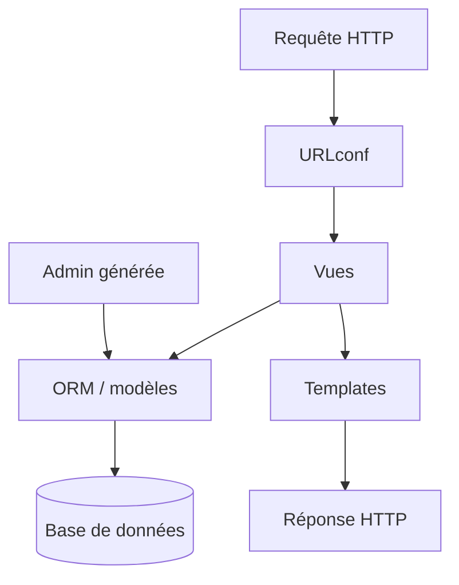

# django/django

> Framework web Python de haut niveau, orienté développement rapide et conception pragmatique.

## Le problème
Construire une application web complète impose de recoller ORM, routage, templates, admin, auth et migrations.
Assembler ces briques une par une coûte du temps et produit des choix incohérents.

## Ce que ça fait vraiment
Fournit l'ensemble en une seule distribution, documentée dans le répertoire `docs/` et en ligne.
Le README est volontairement minimal : il oriente vers l'installation, les tutoriels, les guides thématiques et la référence.
Le parcours recommandé est explicite : `docs/intro/install.txt`, puis les tutoriels dans l'ordre, puis `docs/topics`.
Suite de tests complète, décrite dans `docs/internals/contributing/writing-code/unit-tests.txt`.

## Comment c'est branché

## Essayer
Aucune commande n'est donnée dans le README ; il renvoie à `docs/intro/install.txt`.

## Coût et pièges
Gratuit et libre. Le coût réel est le temps d'apprentissage d'un framework volumineux et opinioné.
La Django Software Foundation vit de dons — le README le rappelle explicitement.

## Ce que ce n'est pas
Pas un micro-framework : les conventions sont fortes et difficiles à contourner à moitié.
Pas orienté API asynchrone temps réel par défaut, ni pensé pour servir des modèles.
Le README ne documente rien par lui-même : tout est dans `docs/`.

## Alternatives
Aucune nommée dans le README.

## Pour toi
Le bon choix dès qu'un projet data a besoin d'une vraie application web autour, avec admin et auth.
