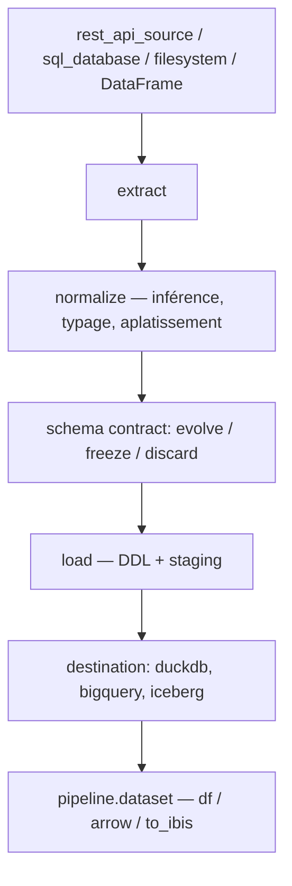

# dlt-hub/dlt

> Bibliothèque Python qui charge des sources désordonnées vers des destinations typées.

## Le problème
Écrire un pipeline d'ingestion, c'est réécrire à chaque fois la pagination, l'inférence de schéma, le typage, le staging et la dérive de schéma.
Les plateformes qui font ça à ta place imposent leur environnement et leurs boîtes noires.

## Ce que ça fait vraiment
`rest_api_source` décrit une API de façon déclarative — client, paginateur, ressources, filtres et maps appliqués à la source — et dlt gère requêtes, schéma et types.
N'importe quel itérable Python devient une ressource : un générateur décoré suffit, et `primary_key` + `write_disposition="merge"` donnent l'upsert.
Changer la chaîne `destination` suffit pour passer de DuckDB à Snowflake, BigQuery, Postgres, Redshift, Databricks, Athena, ClickHouse, Iceberg ou Delta : credentials, DDL, mapping de types, staging et `ALTER TABLE` suivent.
Les contrats de schéma (`evolve`, `freeze`, `discard`) s'appliquent séparément aux tables, colonnes et types ; la Dataset API relit ensuite en DataFrame, Arrow zéro-copie ou expression Ibis compilée en SQL.

## Comment c'est branché


## Essayer
```bash
pip install dlt
pip install "dlt[duckdb]"
pip install "dlt[sql_database]"
```

## Coût et pièges
Gratuit et sans service à créer : tu payes seulement ta destination. Python 3.10 à 3.14, mais 3.14 est déclaré expérimental car certains extras manquent.
Suivre le versionnement recommandé (`dlt~=1.23.0`, patch uniquement) : les versions mineures apportent parfois des migrations automatiques.

## Ce que ce n'est pas
Ce n'est pas une plateforme : pas d'ordonnanceur, pas d'UI, pas d'orchestration — c'est un `pip install` dans ton code existant.
Ce n'est pas non plus ouvert aux contributions de destinations : le README annonce que les nouvelles destinations ne seront probablement pas fusionnées, coût de maintenance oblige.

## Alternatives
Aucun concurrent n'est nommé dans le README ; il renvoie à son propre écosystème de sources et à `dlt[hub]` pour la qualité de données et les transformations.

## Pour toi
Le défaut raisonnable pour toute ingestion Python : typage, merge incrémental et relecture Arrow/Ibis sans plateforme à installer.
