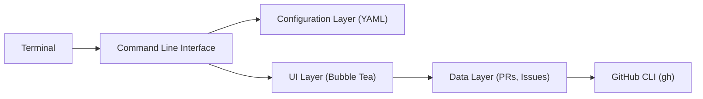

# dlvhdr/gh-dash

> Interface terminal pour suivre ses pull requests et issues GitHub au clavier.

## Le problème
Passer d'un dépôt à l'autre dans le navigateur pour retrouver ses PR et issues à traiter casse le rythme de travail.

## Ce que ça fait vraiment
Un tableau de bord TUI avec des sections de PR et d'issues définies par l'utilisateur, par dépôt. Raccourcis clavier de type vim modifiables, actions personnalisées, tout réglé par un fichier YAML. S'appuie sur `gh` pour GitHub et sur delta pour les diffs.

## Comment c'est branché

## Essayer
Aucune commande d'installation dans le README ; renvoi au site gh-dash.dev/getting-started.

## Coût et pièges
Gratuit. Nécessite `gh` et un compte GitHub. Installation non documentée dans le README.

## Ce que ce n'est pas
Pas un remplaçant de GitHub : il consomme l'API via `gh`. Auteur principal cité : Dolev Hadar « and the community ».

## Alternatives
Aucune alternative nommée dans le README.

## Pour toi
Surveiller : confortable si tu vis dans le terminal et gères beaucoup de PR, sans lien direct avec la data ou l'IA.

