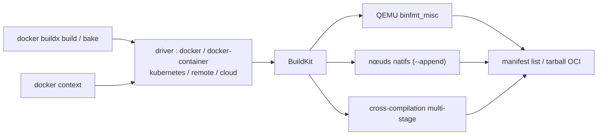

# docker/buildx

> Plugin CLI Docker qui étend `docker build` avec toutes les capacités de BuildKit.

## Le problème
`docker build` classique ne sait pas construire une image multi-architecture, ni répartir un build
sur plusieurs nœuds, ni exporter en tarball OCI, ni mutualiser un cache distribué.

## Ce que ça fait vraiment
Donne la même expérience que `docker build` sur le moteur BuildKit, sans `DOCKER_BUILDKIT=1`, en
ajoutant les instances de builder isolées, les builds multi-nœuds, le support Compose et les builds
de haut niveau avec Bake. Chaque driver définit où et comment le build s'exécute, avec un jeu de
fonctionnalités différent : `docker`, `cloud`, `docker-container`, `kubernetes`, `remote`. Les
instances se créent avec `docker buildx create`, s'inspectent, s'arrêtent, se suppriment, se listent,
et s'étendent par `--append` ; elles s'intègrent à `docker context`, chaque contexte recevant un
builder par défaut. Trois stratégies pour le multi-plateforme : émulation QEMU via `binfmt_misc`,
nœuds natifs multiples dans le même builder, ou cross-compilation en multi-stage avec
`BUILDPLATFORM` et `TARGETPLATFORM`.

## Comment c'est branché


## Essayer
```bash
docker buildx build .
docker buildx bake "https://github.com/docker/buildx.git"
mkdir -p ~/.docker/cli-plugins
mv ./bin/build/buildx ~/.docker/cli-plugins/docker-buildx
git clone https://github.com/docker/buildx.git && cd buildx && make install
chmod +x ~/.docker/cli-plugins/docker-buildx
docker run --privileged --rm tonistiigi/binfmt --install all
docker buildx create --use --name mybuild node-amd64
docker buildx create --append --name mybuild node-arm64
docker buildx build --platform linux/amd64,linux/arm64 .
docker buildx ls
```

## Coût et pièges
Gratuit, mais exige Docker Engine 19.03+ — une version incompatible produit des comportements
inattendus, surtout avec un BuildKit récent. Le téléchargement manuel du binaire n'est pas mis à
jour par les correctifs de sécurité : à réserver aux tests. Pour que QEMU fonctionne de façon
transparente dans les conteneurs, les binaires doivent être enregistrés avec le drapeau
`fix_binary` (noyau ≥ 4.8, binfmt-support ≥ 2.1.7), à vérifier dans `/proc/sys/fs/binfmt_misc/qemu-*`.

## Ce que ce n'est pas
Pas un moteur de build : BuildKit fait le travail, buildx est le pilote. Le multi-plateforme
simultané n'est possible qu'avec les drivers `cloud`, `docker-container`, `kubernetes` ou `remote` —
pas avec le driver `docker` par défaut. L'installation par brew du paquet homonyme n'est pas ce projet.

## Alternatives
- `docker build` avec `DOCKER_BUILDKIT=1` : suffisant pour une seule architecture.

## Pour toi
Indispensable dès que tu publies une image qui doit tourner sur arm64 comme sur amd64.
