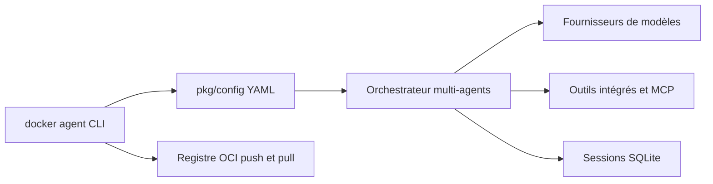

# docker/cagent

> Docker Agent : plugin CLI qui exécute des agents IA décrits en YAML, seuls ou en équipe.

## Le problème
Assembler des agents, des outils et un fournisseur de modèle demande du code de colle à chaque projet.

## Ce que ça fait vraiment
Un fichier YAML décrit modèle, instructions et outils (MCP local, distant ou Docker, outils intégrés think, todo, mémoire). Multi-agents avec délégation, RAG (BM25, embeddings, hybride), fournisseurs OpenAI, Anthropic, Gemini, Bedrock, Mistral, xAI et Docker Model Runner. Les agents se poussent et se tirent depuis un registre OCI.

## Comment c'est branché


## Essayer
```sh
export OPENAI_API_KEY=sk-...
docker agent run agent.yaml
docker agent new
docker agent run myorg/agent:tag
```

## Coût et pièges
Au moins une clé d'API, ou Docker Model Runner pour un modèle local. Docker Desktop 4.63+ l'inclut ; sinon Homebrew ou binaire. La télémétrie anonyme est collectée (voir la page dédiée).

## Ce que ce n'est pas
Pas un framework de code : « sans code » revient à écrire du YAML. Un agent exécutant shell ou fichiers demande de la prudence.

## Alternatives
Aucune alternative nommée dans le README.

## Pour toi
À adopter : YAML versionnable et registre OCI conviennent bien à un profil MLOps ; couper ou vérifier la télémétrie et la licence.
