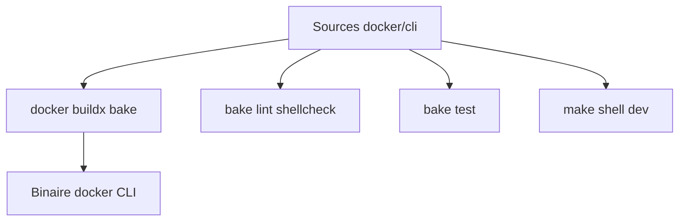

# docker/cli

> Le dépôt du client en ligne de commande Docker.

## Le problème
(Le README ne pose pas de problème : c'est le code source d'un outil ubiquitaire, orienté développement/contribution.)

## Ce que ça fait vraiment
Héberge le code du Docker CLI. Le README couvre surtout le build : compiler depuis les sources avec `docker buildx bake`, cross-compiler pour toutes les plateformes, builds dynamiques glibc/musl, lint, tests unitaires et complets, environnement de dev en conteneur (`make shell`). Sous licence Apache 2.0.

## Comment c'est branché


## Essayer
```shell
docker buildx bake
```
```shell
docker buildx bake test
```

## Coût et pièges
Gratuit (Apache 2.0). Usage/transfert de Docker soumis à d'éventuelles restrictions export US (voir NOTICE). README purement orienté contribution, pas d'usage produit.

## Ce que ce n'est pas
Pas une documentation d'utilisation de Docker : le dépôt du code du CLI, pour ceux qui le construisent ou le modifient.

## Alternatives
Non nommées dans le README.

## Pour toi
Aucun intérêt pratique direct sauf si tu contribues au CLI Docker lui-même — ignorer.
