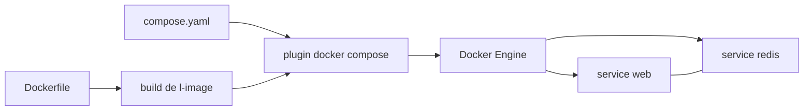

# docker/compose

> **Docker's multi-container app launcher**, for anyone who would rather declare a stack than type it.

## The problem

Without Compose, running several linked containers together — a web app and its Redis, say — means
chaining `docker run` calls, networks and volumes by hand, repeating the same sequence on every
machine, and hoping it comes out identical. The README never states this problem outright; it
leaves it to be inferred from its three-step example.

## What it actually does

Compose reads a `compose.yaml` file written in the [Compose file format](https://compose-spec.io)
and creates then starts the containers it describes, with a single command: `docker compose up`.
The file declares, per service, an image or a build context (`build: .`), published ports
(`"5000:5000"`) and mounted volumes (`.:/code`). It is a Docker CLI plugin, written in Go,
installed into a `cli-plugins` directory. The README documents no subcommand other than `up`, and
no detail of the specification — it points at the format's own site instead.

## How it is wired



No code-derived diagram exists for this repository: these nodes are inferred from the README alone.
The path it describes has three stages — a `Dockerfile` pins the app's environment, a
`compose.yaml` declares the services making up the app, then `docker compose up` hands everything
to the Docker daemon, which runs each service in a shared isolated environment. The README says
nothing about the binary's internals.

## Trying it

```bash
# Linux: fetch the binary from the release page, then
chmod +x docker-compose
# place it as a user plugin…
# $HOME/.docker/cli-plugins
# …or system-wide, e.g. /usr/local/lib/docker/cli-plugins

# then, in a directory holding a Dockerfile and a compose.yaml:
docker compose up
```

On Windows and macOS the README states Compose ships inside Docker Desktop, so nothing needs
installing. The install paths above are the ones the README lists; it gives no download command,
so none is reconstructed here.

## Cost and traps

The code is Apache-2.0 and the binary is free. The real prerequisite is a working Docker engine:
on Windows and macOS that means Docker Desktop, a third-party product whose terms and pricing the
README does not discuss. One trap is spelled out plainly: Docker Swarm stopped at the legacy
compose file format and never adopted the Compose Specification — since the Mirantis acquisition
it is no longer maintained by Docker Inc, and some Compose features are unavailable there. Another
is versioning: the Python Compose survives only on the legacy `v1` branch.

## What it is not

It is not a multi-machine production orchestrator: Compose starts containers on one Docker host,
and the README explicitly points to Swarm — unmaintained — for clustering. Nor is it the
specification itself: the file format lives separately at compose-spec.io, and Compose is one
implementation of it. Finally it is no longer the Python tool many still picture under the hyphenated
name `docker-compose`, which is archived on the `v1` branch. The README stays very short for a
repository this size, hence the "insufficient material" flag: nearly all real behaviour is
documented elsewhere.

## Alternatives

Docker Swarm, the only comparable thing named in the README, for orchestrating across machines —
but the README warns it is no longer maintained by Docker Inc and lags the current specification.
Among the catalogue neighbours, only moby/buildkit touches the same ground, from the other end: it
builds the images Compose merely assembles and runs. semaphoreui/semaphore, anchore/grype and
nginx/kubernetes-ingress are not comparable.

## For you

For a data / AI / MLOps profile, this is the baseline tool for standing up a local dependency stack
— database, cache, tracking server, worker — without a homegrown script or a cluster. Adopt it as
the foundation of a reproducible dev environment, not as a deployment target: multi-node production
is played elsewhere.
