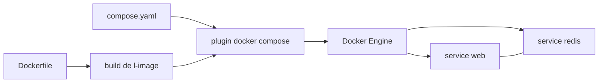

# docker/compose

> **Le lanceur d'applis multi-conteneurs de Docker**, pour qui décrit sa pile dans un fichier plutôt qu'en commandes.

## Le problème

Sans Compose, faire tourner ensemble plusieurs conteneurs liés (une appli web et son Redis, par
exemple) revient à enchaîner à la main des `docker run`, des réseaux et des volumes, à refaire la
même séquence sur chaque machine, et à espérer qu'elle soit identique partout. Le README ne
formule pas ce problème explicitement ; il le laisse déduire de son exemple à trois étapes.

## Ce que ça fait vraiment

Compose lit un fichier `compose.yaml` écrit au [Compose file format](https://compose-spec.io) et
crée puis démarre les conteneurs qu'il décrit, en une commande : `docker compose up`. Le fichier
déclare pour chaque service son image ou son contexte de build (`build: .`), ses ports publiés
(`"5000:5000"`) et ses volumes montés (`.:/code`). C'est un plugin de la CLI Docker, écrit en Go,
qui s'installe dans un dossier `cli-plugins`. Le README ne documente ni les sous-commandes autres
que `up`, ni le détail de la spécification — il renvoie au site du format. Il n'y a donc pas
matière, ici, à décrire ce que Compose fait au-delà du démarrage d'une pile déclarée.

## Comment c'est branché



Aucun diagramme tiré du code n'existe pour ce dépôt : ces nœuds sont déduits du seul README. Le
parcours qu'il décrit est en trois temps — un `Dockerfile` fige l'environnement de l'appli, un
`compose.yaml` déclare les services qui la composent, puis `docker compose up` passe le tout au
démon Docker, qui instancie chaque service dans un environnement isolé partagé. Le README ne dit
rien de l'architecture interne du binaire.

## Essayer

```bash
# Linux : récupérer le binaire depuis la release page, puis
chmod +x docker-compose
# le placer en plugin utilisateur…
# $HOME/.docker/cli-plugins
# …ou système-wide, par exemple /usr/local/lib/docker/cli-plugins

# puis, dans un dossier contenant Dockerfile et compose.yaml :
docker compose up
```

Sous Windows et macOS, le README indique que Compose est déjà inclus dans Docker Desktop : rien à
installer. Les chemins d'installation ci-dessus sont ceux listés dans le README ; aucune commande
de téléchargement n'y est donnée, elle n'est donc pas reconstruite ici.

## Coût et pièges

Le code est sous Apache-2.0 et le binaire est gratuit. Le vrai prérequis est un moteur Docker
fonctionnel : sur Windows et macOS, cela passe par Docker Desktop, produit tiers dont le README ne
discute ni les conditions ni le prix. Piège signalé noir sur blanc : Docker Swarm s'est arrêté au
format de fichier hérité et n'a jamais adopté la Compose Specification — depuis le rachat par
Mirantis, Swarm n'est plus maintenu par Docker Inc et certaines fonctions de Compose y sont
inaccessibles. Autre piège de version : la Compose en Python n'existe plus que sur la branche
`v1`, en héritage.

## Ce que ce n'est pas

Ce n'est pas un orchestrateur de production multi-machines : Compose démarre des conteneurs sur un
hôte Docker, et le README oriente explicitement vers Swarm — non maintenu — pour le cluster. Ce
n'est pas non plus la spécification elle-même : le format de fichier vit à part, sur compose-spec.io,
et Compose n'en est qu'une implémentation. Enfin, ce n'est plus l'outil Python que beaucoup ont en
tête sous le nom `docker-compose` avec un tiret : celui-ci est archivé en branche `v1`. Le README
reste très court pour un dépôt de cette taille — d'où l'alerte « matière insuffisante » : presque
tout le comportement réel est documenté ailleurs.

## Alternatives

Docker Swarm, seul comparable nommé dans le README, pour orchestrer sur plusieurs machines — mais
le README prévient qu'il n'est plus maintenu par Docker Inc et qu'il ignore la spécification
récente. Parmi les voisins du catalogue, seul moby/buildkit touche au même terrain, et par un
autre bout : il construit les images que Compose se contente d'assembler et de lancer.
semaphoreui/semaphore, anchore/grype et nginx/kubernetes-ingress ne sont pas comparables.

## Pour toi

Pour un profil data / IA / MLOps, c'est l'outil de base pour monter en local une pile de
dépendances — base de données, cache, tracking server, worker — sans script maison ni cluster.
À adopter comme socle de l'environnement de dev reproductible, mais pas comme cible de
déploiement : la mise en production multi-nœuds se joue ailleurs.
