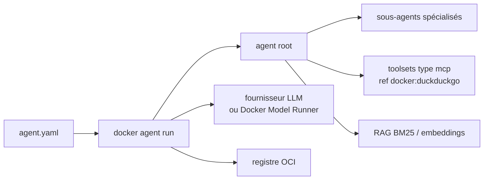

# docker/docker-agent

> Plugin CLI Docker qui définit et exécute des agents IA en YAML, pour développeurs déjà outillés Docker.

## Le problème
Assembler une équipe d'agents demande du code de colle : orchestration, délégation, outils, retrieval.
Rien n'est versionnable ni partageable simplement.

## Ce que ça fait vraiment
Définition déclarative en YAML (`agents.root` : modèle, description, instruction, toolsets).
Architecture multi-agents avec délégation automatique. Outils intégrés (think, todo, memory) plus
n'importe quel serveur MCP, local, distant ou Docker. RAG branchable : BM25, embeddings, hybride, reranking.
Agnostique fournisseur : OpenAI, Anthropic, Gemini, AWS Bedrock, Mistral, xAI, Docker Model Runner.
Publication et exécution depuis n'importe quel registre OCI.

## Comment c'est branché


## Essayer
```bash
brew install docker-agent
export OPENAI_API_KEY=sk-...
docker agent run agent.yaml
docker agent new
docker agent run myorg/agent:tag
```

## Coût et pièges
Pré-installé avec Docker Desktop 4.63+. Facture du fournisseur à ta charge, sauf en modèles locaux
via Docker Model Runner. Le README annonce une collecte de données d'usage anonymes.

## Ce que ce n'est pas
Ce n'est pas un modèle ni un runtime d'inférence : il faut une clé ou un modèle local.
Ce n'est pas indépendant de l'écosystème Docker. Les capacités avancées (mode MCP, TUI, RAG)
ne sont décrites que dans la documentation externe, pas dans le README.

## Alternatives
Docker Model Runner, cité pour l'inférence locale plutôt qu'une clé cloud.

## Pour toi
À tester si ton équipe vit déjà dans Docker : le YAML versionné vaut mieux qu'un script d'orchestration.
