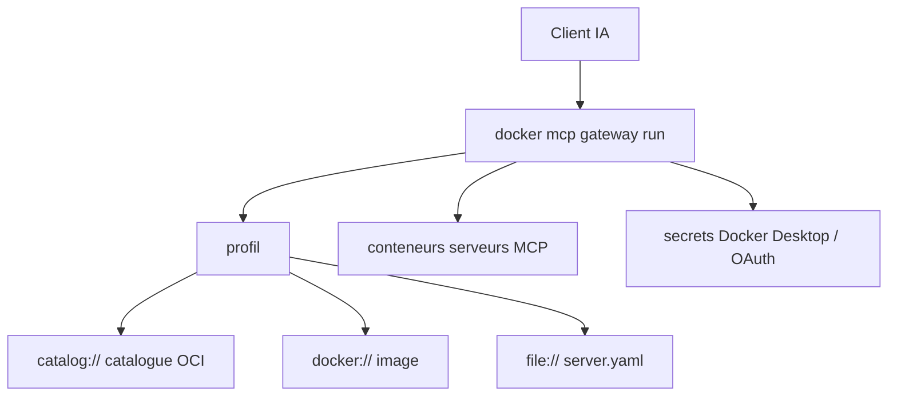

# docker/mcp-gateway

> Plugin CLI Docker qui fait tourner les serveurs MCP en conteneurs isolés derrière une passerelle unique.

## Le problème
Chaque client IA configure ses serveurs MCP de son côté, avec des clés d'API en clair dans des variables d'environnement.
Les serveurs npx et uvx tournent avec les privilèges de la machine hôte, sans isolation.

## Ce que ça fait vraiment
Regroupe les serveurs en **profils** référençant un catalogue OCI, une image Docker, le registre MCP public ou un fichier local.
Chaque serveur du catalogue tourne dans son conteneur ; npx et uvx reçoivent des privilèges hôte minimaux.
Expose une passerelle unique (stdio, sse ou streaming) que tous les clients — VS Code, Cursor, Claude Desktop, Claude Code — partagent.
Gère les secrets via Docker Desktop, les flux OAuth, la découverte dynamique des outils et une liste blanche d'outils par profil.

## Comment c'est branché


## Essayer
```bash
git clone https://github.com/docker/mcp-gateway.git
cd mcp-gateway
mkdir -p "$HOME/.docker/cli-plugins/"
make docker-mcp
docker mcp catalog pull mcp/docker-mcp-catalog
docker mcp gateway run --profile dev-tools
```

## Coût et pièges
Docker Desktop 4.59+ avec MCP Toolkit attendu ; hors Desktop (WSL2, Docker CE), poser `DOCKER_MCP_IN_CONTAINER=1` et activer `docker mcp feature enable profiles`.
Go 1.24+ seulement pour compiler le plugin soi-même.

## Ce que ce n'est pas
Pas un serveur MCP : c'est l'infrastructure qui en fait tourner d'autres.
Pas indépendant de Docker : le modèle d'isolation est le conteneur, sans plan B sans démon Docker.
`docker mcp secret export` reste une exigence temporaire pour les exécutions Docker Cloud.

## Alternatives
Aucune alternative nommée dans le README.

## Pour toi
Si tu accumules des serveurs MCP, c'est le moyen le plus direct de les isoler et de partager une seule configuration entre clients.
