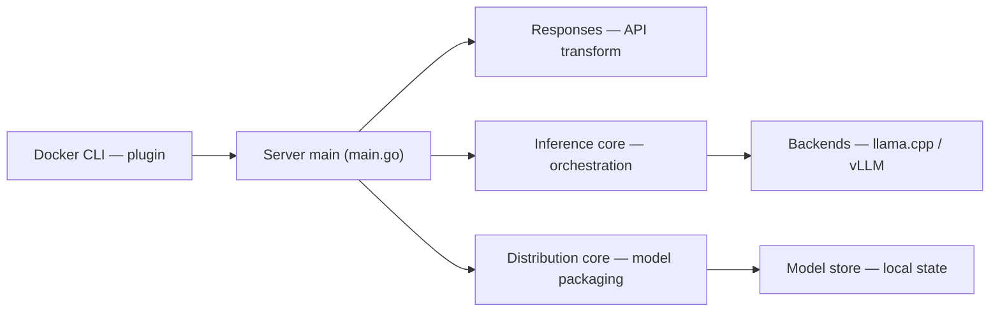

# docker/model-runner

> Runtime Docker pour télécharger, exécuter et servir des modèles IA depuis Docker Hub ou tout registre OCI.

## Le problème
Servir un LLM en local demande d'assembler un moteur d'inférence, des poids et une API, sans workflow commun.

## Ce que ça fait vraiment
Un serveur Go expose une API REST de gestion de modèles, des endpoints compatibles OpenAI (et Ollama d'après le code), des métriques Prometheus et des logs. Le planificateur choisit un backend : llama.cpp par défaut, vLLM, SGLang, diffusers ou MLX. Le plugin `docker model`, le binaire autonome `dmr` et un chart Helm expérimental complètent l'ensemble.

## Comment c'est branché


## Essayer
```bash
docker model run ai/gemma3 "Hello"
brew install docker/tap/dmr
./dmr serve &
./dmr pull ai/gemma3
make docker-run PORT=3000 MODELS_PATH=/path/to/your/models
```

## Coût et pièges
Inclus dans Docker Desktop et Docker Engine ; les variantes CUDA/ROCm exigent une image de base adaptée. Le README est tronqué en fin de section dmrlet. 75 issues ouvertes. Le port 12434 est celui de Docker Desktop.

## Ce que ce n'est pas
Pas un service géré ni un orchestrateur à grande échelle ; le support Kubernetes est expérimental. Les conteneurs NIM demandent une clé NGC.

## Alternatives
Aucune alternative citée dans le README.

## Pour toi
À adopter pour l'inférence locale et les tests : API compatible OpenAI, modèles empaquetés comme des images OCI, déjà présent dans Docker Desktop.
