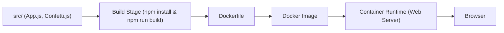

# docker/welcome-to-docker

> Petite application React de démonstration servie dans un conteneur, pour débuter avec Docker.

## Le problème
Un débutant Docker a besoin d'un premier conteneur qui affiche quelque chose dans le navigateur.

## Ce que ça fait vraiment
README minimal (moins de 800 caractères). Il donne une commande `docker run` qui expose le port 8088 et une procédure de build local. D'après le code, c'est une SPA React (App.js, Confetti.js) servie en statique, sans backend.

## Comment c'est branché


## Essayer
```bash
docker run -d -p 8088:80 --name welcome-to-docker docker/welcome-to-docker
docker build -t welcome-to-docker .
docker run -d -p 8088:3000 --name welcome-to-docker welcome-to-docker
```

## Coût et pièges
Rien à payer ; il faut Docker. Le port du conteneur diffère entre l'image publiée (80) et le build local (3000).

## Ce que ce n'est pas
Ni un tutoriel détaillé ni un modèle d'application : le README renvoie à MAINTAINERS.md pour la maintenance. Aucune licence déclarée au catalogue.

## Alternatives
Aucune alternative citée dans le README.

## Pour toi
À ignorer : c'est une démo d'accueil de Docker, sans valeur pour un profil data / IA, et sans licence explicite.
