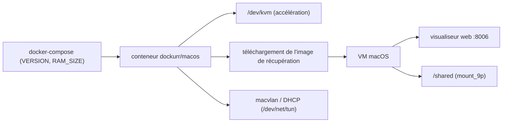

# dockur/macos

> macOS dans un conteneur Docker, avec téléchargement automatique des fichiers d'installation.

## Le problème
Tester quelque chose sur macOS sans Mac disponible suppose de monter une VM à la main, de trouver
les images d'installation et de configurer le réseau et l'affichage.

## Ce que ça fait vraiment
Le conteneur télécharge l'image de récupération, expose un visualiseur web sur le port 8006 et
laisse dérouler l'installation depuis le menu de récupération (formatage APFS via Disk Utility,
puis « Reinstall macOS »). Accélération KVM, CPU/RAM/disque paramétrables (`RAM_SIZE`, `CPU_CORES`,
`DISK_SIZE`), ballonnage mémoire, passage de périphériques USB et de disques, partage de dossier via
`mount_9p`, réseaux NAT, user-mode, macvlan et macvtap, DHCP. Versions 11 à 15 sélectionnables par
`VERSION`.

## Comment c'est branché


## Essayer
```bash
docker run -it --rm --name macos -e "VERSION=14" -p 8006:8006 --device=/dev/kvm --device=/dev/net/tun --cap-add NET_ADMIN -v "${PWD:-.}/macos:/storage" --stop-timeout 120 docker.io/dockurr/macos
sudo apt install cpu-checker
sudo kvm-ok
```

## Coût et pièges
Hôte Linux avec KVM, processeur AVX2, 4 Go de RAM et 32 Go de disque minimum. Docker Desktop sur
Linux, macOS et Windows 10 ne donne pas accès à KVM et n'est pas supporté. Sur AMD, le README
déconseille plusieurs cœurs ou plus de 8 Go au départ : instabilité et gel au choix du pays. macOS 26
est sélectionnable mais déconseillé, très lent pour une raison inconnue.

## Ce que ce n'est pas
Pas légal partout : le README est explicite — l'EULA d'Apple interdit l'installation sur du matériel
non officiel, donc le conteneur ne doit tourner que sur du matériel vendu par Apple. Le projet ne
distribue pas macOS et ne contourne aucune protection. Ce n'est pas non plus une installation
automatique : une douzaine d'étapes manuelles sont à suivre dans le visualiseur.

## Alternatives
- `dockur/windows` : le même principe pour Windows, avec installation entièrement automatique.
- `qemus/qemu` : pour un bureau Linux en conteneur.

## Pour toi
Sans usage professionnel ici, et la contrainte d'EULA suffit à clore le sujet.
