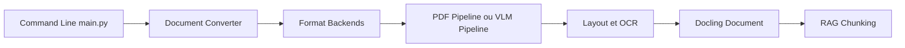

# docling-project/docling

> Convertit PDF, Office, images et audio en document structuré, pour alimenter des chaînes RAG ou d'IA.

## Le problème
Les documents bureautiques et PDF perdent structure et tableaux quand on les fournit tels quels à un modèle.

## Ce que ça fait vraiment
README identique à celui de `DS4SD/docling` : analyse de nombreux formats, représentation `DoclingDocument`, export Markdown, HTML, JSON, OCR, modèles visuels, audio par reconnaissance vocale, serveur MCP et docling-serve. Le code montre CLI ou API Python, backend de format, pipeline (PDF, VLM, ASR, vidéo), étapes d'IA (mise en page, OCR, tableaux, ordre de lecture) puis export ou découpage.

## Comment c'est branché


## Essayer
```bash
pip install docling
docling https://arxiv.org/pdf/2206.01062
docling --pipeline vlm --vlm-model granite_docling https://arxiv.org/pdf/2206.01062
```

## Coût et pièges
Python 3.10 minimum. Ressources matérielles des modèles non documentées. Anomalie : doublon apparent de `DS4SD/docling` (même date de création, README identique, étoiles différentes) ; l'organisation `docling-project` semble le dépôt actuel, non vérifié ici.

## Ce que ce n'est pas
Ce n'est pas un LLM ni un service hébergé. Fonctions « coming soon » non livrées.

## Alternatives
Aucune alternative nommée dans le README.

## Pour toi
Adopter : même brique d'ingestion ; retenir un seul des deux dépôts dans le catalogue, probablement celui-ci.

