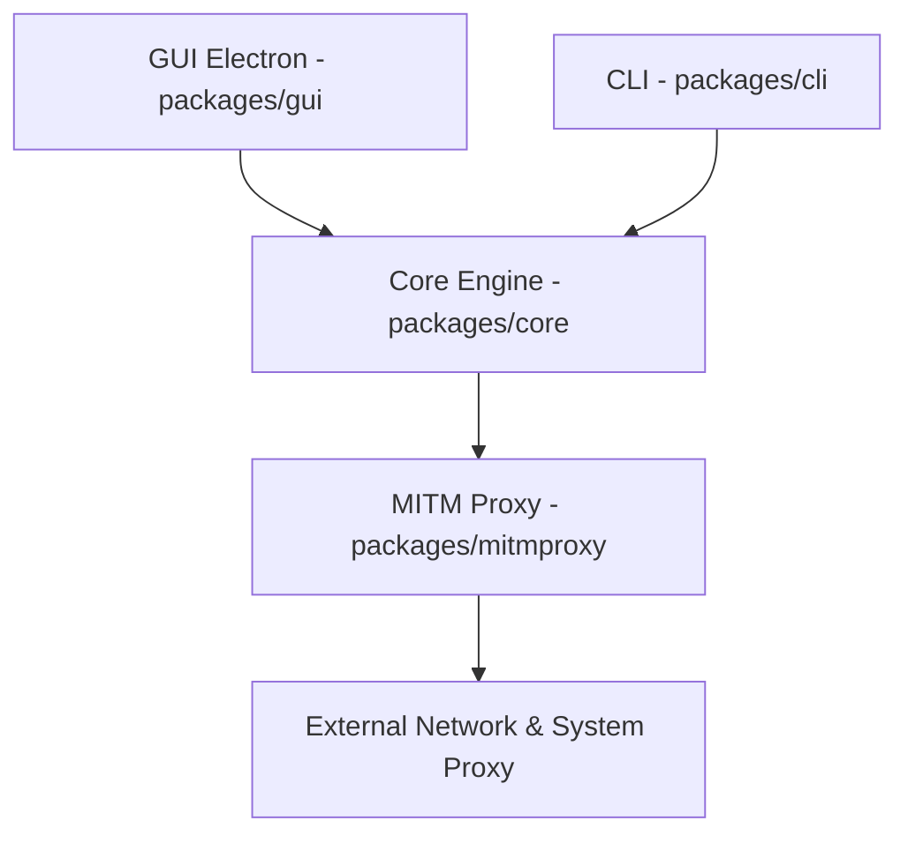

# docmirror/dev-sidecar

> Application de bureau qui redirige le trafic HTTPS des développeurs vers des accélérateurs, GitHub surtout.

## Le problème
Accéder de façon fiable et rapide à GitHub, npm, Stack Overflow et d'autres services depuis des réseaux où ils sont lents ou inaccessibles.

## Ce que ça fait vraiment
Proxy local qui modifie le proxy système au démarrage. Il choisit le meilleur IP par résolution DNS et test de vitesse, intercepte des requêtes selon des règles (redirection, proxy, abandon, cache) et peut modifier le SNI. Il propose un proxy npm et git. Trois modes : sûr (sans interception ni certificat), par défaut (interception, config distante) et amélioré. L'interface est en chinois.

## Comment c'est branché


## Essayer
```bash
git clone https://github.com/docmirror/dev-sidecar
cd dev-sidecar
pnpm install
cd packages/gui
npm run electron
```

## Coût et pièges
Gratuit. Le mode par défaut demande d'installer un certificat racine généré localement ; le README annonce qu'aucune donnée n'est collectée, mais avertit de ne pas utiliser de configuration distante inconnue. Une fermeture brutale peut laisser le proxy système actif et couper l'accès réseau.

## Ce que ce n'est pas
Ce n'est pas un VPN et il est incompatible avec les autres proxys locaux. Le README précise que son but est l'accès direct à GitHub : inutile si l'on a déjà un autre accès. Contourner des blocages réseau peut être encadré légalement selon les pays.

## Alternatives
- Watt Toolkit (ex-Steam++) : cité comme compatible en mode hosts.
- fgit-go : outil d'accélération de clone cité dans le README.

## Pour toi
À ignorer : besoin de niche (accès à GitHub depuis certains réseaux), certificat racine à installer et documentation en chinois ; sans ce besoin précis, le risque dépasse l'intérêt.

