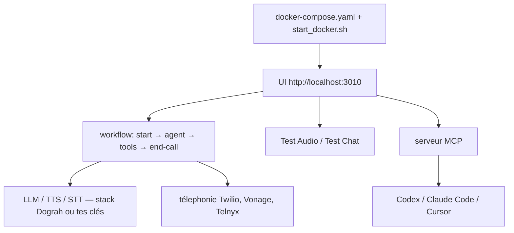

# dograh-hq/dograh

> Constructeur visuel d'agents vocaux auto-hébergeable, alternative ouverte à Vapi et Retell.

## Le problème
Les plateformes d'agents vocaux sont propriétaires, facturées à la minute, et les données transitent par leur cloud.
Impossible de modifier le comportement au-delà de ce que l'éditeur expose.

## Ce que ça fait vraiment
Un constructeur visuel de workflow : nœuds de départ, nœuds d'agent, instructions globales, outils, transitions, sorties de fin d'appel, nœud QA, bases de connaissance et webhooks.
Deux modes de test : « Test Audio » pour parler à l'agent dans le navigateur, « Test Chat » pour itérer plus vite en texte — avec réédition ou rejeu d'un tour utilisateur et régénération des réponses à partir de ce point.
Télephonie intégrée : Twilio, Vonage, Telnyx, Plivo, Vobiz, Cloudonix, Asterisk ARI, avec transfert vers un humain sur les fournisseurs compatibles.
Un serveur MCP permet à Codex, Claude Code ou Cursor d'inspecter les agents existants, lire les schémas de nœuds, créer des workflows et enregistrer des brouillons.

## Comment c'est branché


## Essayer
```bash
curl -o docker-compose.yaml https://raw.githubusercontent.com/dograh-hq/dograh/main/docker-compose.yaml && curl -o start_docker.sh https://raw.githubusercontent.com/dograh-hq/dograh/main/scripts/start_docker.sh && chmod +x start_docker.sh && ./start_docker.sh
```

## Coût et pièges
Auto-hébergé, c'est gratuit sous BSD 2-Clause ; l'offre cloud est facturée à l'usage. Aucune clé n'est requise au départ — la pile LLM/TTS/STT est fournie.
Des données d'usage anonymes sont collectées par défaut : `ENABLE_TELEMETRY=false` avant le script de démarrage. Premier lancement : 2–3 minutes de téléchargement d'images.

## Ce que ce n'est pas
Ce n'est pas une brique : c'est une pile complète (backend Python, UI, MinIO, télephonie) à faire tourner.
Le tableau comparatif face à Vapi et Retell est écrit par l'éditeur ; « #1 Product of the Day » sur Product Hunt n'est pas une preuve technique.

## Alternatives
- Vapi : SaaS propriétaire, si tu ne veux pas héberger.
- Retell : idem, comparé sur les mêmes axes dans le README.

## Pour toi
À regarder si le vocal t'intéresse et que la résidence des données compte ; sinon c'est une pile lourde pour un besoin ponctuel.
