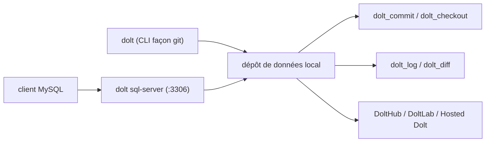

# dolthub/dolt

> Une base SQL compatible MySQL qu'on branche, commit, fork et merge comme un dépôt Git.

## Le problème
Git versionne des fichiers, pas des tables. Un jeu de données qui évolue n'a ni diff, ni blâme,
ni branche, ni retour arrière — juste des dumps datés que personne ne sait comparer.

## Ce que ça fait vraiment
Un serveur MySQL complet (clés étrangères, index secondaires, triggers, contraintes, procédures,
jusqu'à douze tables jointes) doublé d'un versionnement. En CLI, toutes les commandes Git existent
(`add`, `commit`, `diff`, `branch`, `merge`, `cherry-pick`, `revert`, `blame`, `filter-branch`).
En SQL, les lectures passent par des tables système (`dolt_log`, `dolt_status`, `dolt_diff`,
`dolt_diff_<table>`) et les écritures par des procédures (`dolt_add`, `dolt_commit`, `dolt_checkout`,
`dolt_reset`, `dolt_revert`, `dolt_undrop`).

## Comment c'est branché


## Essayer
```bash
sudo bash -c 'curl -L https://github.com/dolthub/dolt/releases/latest/download/install.sh | bash'
dolt config --global --add user.email YOU@DOMAIN.COM
dolt sql-server
dolt -u root -p "" sql
```

## Coût et pièges
Un binaire de ~103 Mo, rien d'autre. Le client MySQL doit être en 8.4 : la 9.0 change
l'authentification et ne se connecte pas par défaut. Un commit Dolt n'est pas un `COMMIT` SQL —
deux notions distinctes, réconciliées par la variable `@@dolt_transaction_commit`.

## Ce que ce n'est pas
Pas du PostgreSQL : pour ça, le README renvoie à Doltgres, encore en bêta. Pas un stockage de
fichiers : Dolt versionne des tables, pas des CSV posés à côté. DoltHub, DoltLab et Hosted Dolt
sont des produits distincts, payants pour l'hébergement privé.

## Alternatives
- Doltgres : même idée sur le protocole Postgres, annoncé en bêta.
- DoltHub : l'hébergement public gratuit, si tu ne veux pas de serveur.
- DoltLab : DoltHub auto-hébergé, si les données ne doivent pas sortir.

## Pour toi
Le bon outil pour versionner un jeu de référence ou une mémoire d'agent : le README le revendique explicitement.
