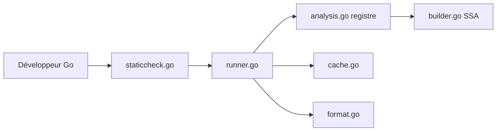

# dominikh/go-tools

> Staticcheck, l'analyseur statique pour Go qui détecte bugs, lenteurs et code inutile.

## Le problème
Le compilateur Go laisse passer des bugs subtils, des API dépréciées et du code mort. Sans analyse statique, ils ne sont vus qu'en revue ou en production.

## Ce que ça fait vraiment
Staticcheck charge les paquets, exécute des vérifications enregistrées (bugs, simplifications, style, code inutilisé) et affiche les diagnostics, avec un cache de résultats. L'analyse s'appuie sur une représentation SSA, dont une analyse de nil. Le dépôt contient aussi `structlayout`, `structlayout-optimize` et `structlayout-pretty` pour la disposition mémoire des structures.

## Comment c'est branché


## Essayer
```bash
go install honnef.co/go/tools/cmd/staticcheck@2022.1
```

## Coût et pièges
Gratuit, financé par des sponsors. Le README conseille les versions taguées ; la branche master peut casser le build. Les bibliothèques internes n'ont pas d'API stable.

## Ce que ce n'est pas
Pas un formateur ni un outil de test. Les bibliothèques du dépôt ne sont pas faites pour être importées. 578 issues ouvertes.

## Alternatives
Aucune alternative nommée dans le README.

## Pour toi
Surveiller : utile si tu écris du Go (outils MLOps, opérateurs), sinon sans objet pour du Python.

