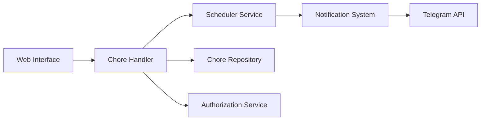

# donetick/donetick

> Application auto-hébergée de tâches et corvées partagées, avec rotation, points et notifications.

## Le problème
Répartir des tâches récurrentes dans un foyer ou une équipe sans que personne ne les oublie.

## Ce que ça fait vraiment
Serveur Go avec SQLite : création de tâches en langage naturel, récurrence flexible (y compris adaptative), rotation des responsables, sous-tâches, étiquettes, « Things » (valeurs suivies), tags NFC, points, statistiques. Connexion locale ou OIDC avec rôles par groupes, MFA TOTP, API REST, webhooks, intégration Home Assistant, notifications Telegram, Discord, Pushover.

## Comment c'est branché


## Essayer
```bash
docker pull donetick/donetick
docker run \
  -v /path/to/host/data:/donetick-data \
  -v /path/to/host/config:/config \
  -p 2021:2021 \
  -e DT_ENV=selfhosted \
  -e DT_SQLITE_PATH=/donetick-data/donetick.db \
  donetick/donetick
```

## Coût et pièges
Gratuit. Un fichier `selfhosted.yaml` est requis. Le mode hors ligne est très limité, l'app iOS est en alpha. 184 issues ouvertes.

## Ce que ce n'est pas
Pas un outil de travail data/IA ni un gestionnaire de projet d'équipe complet.

## Alternatives
Aucune alternative nommée dans le README.

## Pour toi
À ignorer pour la veille pro : application domestique bien faite, mais sans lien avec data, IA ou MLOps.
