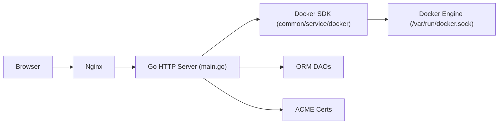

# donknap/dpanel

> Panneau web léger pour gérer conteneurs Docker et Podman, documenté surtout en chinois.

## Le problème
Gérer des conteneurs, images, fichiers et Compose depuis un navigateur évite la ligne de commande sur un serveur personnel ou d'équipe.

## Ce que ça fait vraiment
Un conteneur unique expose une interface web (React, UmiJS, Ant Design) devant un serveur Go. D'après le code, le serveur pilote Docker via `/var/run/docker.sock` avec le SDK Docker, planifie des tâches cron, gère certificats ACME, SSH, stockage distant (rclone), plugins et synchronisation de registre. Nginx sert les statiques et redirige les domaines. La version « Lite » retire la partie domaines et certificats ; une version Pro payante existe.

## Comment c'est branché


## Essayer
```bash
docker run -d --name dpanel --restart=always \
 -p 80:80 -p 443:443 -p 8807:8080 -e APP_NAME=dpanel \
 -v /var/run/docker.sock:/var/run/docker.sock \
 -v /home/dpanel:/dpanel dpanel/dpanel:latest
```
Une variante `dpanel/dpanel:lite` et un script `curl … quick.sh | sudo bash` sont aussi proposés.

## Coût et pièges
Le panneau monte le socket Docker : quiconque y accède contrôle l'hôte. Les images sont aussi sur un registre chinois (Aliyun). Le script d'installation est à lire avant exécution. Licence présente mais non identifiée par GitHub.

## Ce que ce n'est pas
Ce n'est pas un outil pensé pour la data ou le MLOps : ni orchestration, ni suivi de jobs. La documentation, la communauté (QQ, WeChat) et les sponsors sont chinois ; le README anglais n'existe pas.

## Alternatives
Aucune alternative nommée dans le README.

## Pour toi
À ignorer : gestionnaire de conteneurs généraliste, à mainteneur unique, documenté en chinois ; il n'apporte rien de spécifique à un flux data ou IA.
