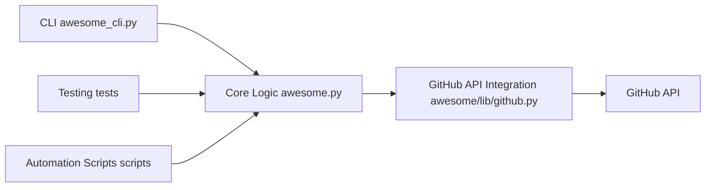

# donnemartin/awesome-aws

> Liste organisée de SDK, outils open source, guides et ressources AWS.

## Le problème
L'écosystème AWS est immense ; trouver les bons outils communautaires par service prend du temps.

## Ce que ça fait vraiment
Index par langage (SDK), par service (Lambda, S3, DynamoDB, Kinesis…), guides, blogs, conférences.
« Fiery Meter » : icônes selon le nombre d'étoiles, recalculé par un module Python `awesome-aws` qui interroge GitHub.
Annexe décrivant les services AWS en une ligne.

## Comment c'est branché

## Essayer
Aucune commande documentée.

## Coût et pièges
Gratuit. Dernier push en mars 2024 ; beaucoup d'entrées datent d'avant (KPIs, services anciens).

## Ce que ce n'est pas
Pas une liste à jour de l'IA sur AWS : la section Machine Learning se réduit à des exemples anciens.

## Alternatives
Aucune alternative nommée hors listes « awesome » génériques.

## Pour toi
À ignorer : liste vieillissante, peu utile pour MLOps AWS actuel ; la doc officielle sert mieux.
