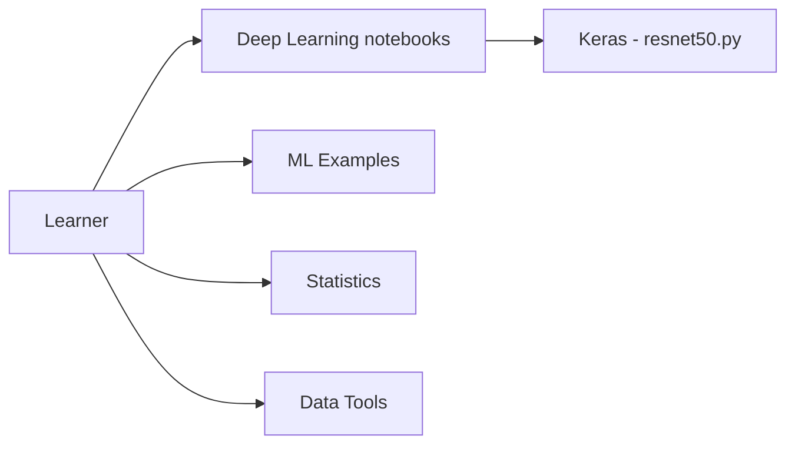

# donnemartin/data-science-ipython-notebooks

> Recueil de notebooks pédagogiques sur le deep learning, scikit-learn, pandas et Spark, pour débutants.

## Le problème
Trouver des exemples guidés et exécutables pour apprendre les briques de la data science en Python.

## Ce que ça fait vraiment
Index de notebooks : TensorFlow, Theano, Keras, Caffe, scikit-learn, SciPy, pandas, matplotlib, NumPy, Spark/HDFS, MapReduce avec mrjob, AWS, ligne de commande, Kaggle (Titanic, churn). Le README précise que les notebooks ont été testés avec Python 2.7.x. Le graphe liste des modèles Keras (VGG, ResNet50), des scripts statistiques et NumPy/pandas/matplotlib.

## Comment c'est branché


## Essayer
```bash
git clone https://github.com/donnemartin/data-science-ipython-notebooks.git
cd data-science-ipython-notebooks
jupyter notebook
```

## Coût et pièges
Gratuit. Contenu daté : Python 2.7, Theano, Caffe, anciennes API TensorFlow. Dernier push en mars 2024.

## Ce que ce n'est pas
Pas un cours à jour ni un projet maintenu : c'est un reliquat pédagogique. Pas de paquet à installer.

## Alternatives
Aucune alternative nommée dans le README (les tutoriels TensorFlow tiers y sont listés comme compléments).

## Pour toi
À ignorer : pile technologique périmée (Python 2.7, Theano) ; des ressources récentes couvrent mieux les mêmes sujets.

