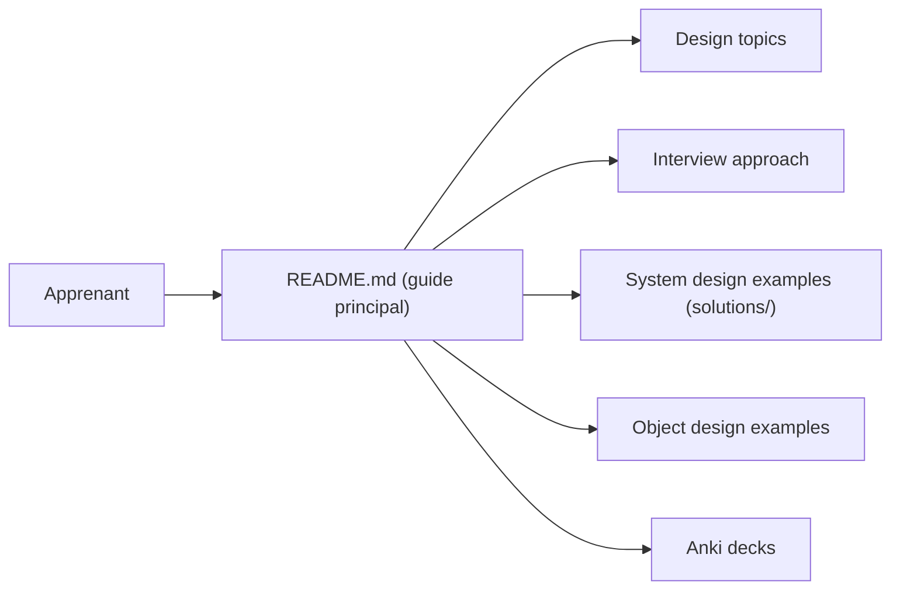

# donnemartin/system-design-primer

> Guide de révision pour concevoir des systèmes à grande échelle et préparer les entretiens de system design.

## Le problème
Les principes de conception de systèmes distribués sont éparpillés sur le web, sans ordre. Préparer un entretien de system design, ou justifier un choix d'architecture, demande de tout recouper à la main.

## Ce que ça fait vraiment
Un long README organisé en sujets : CAP, cohérence, réplication, sharding, cache, files de messages, REST/RPC, avec pour chaque sujet les inconvénients et des liens. S'y ajoutent des exercices avec solutions (Pastebin, crawler, Mint, Twitter, ventes Amazon, AWS), des exercices orientés objet, des tables de latences et de puissances de deux, et des decks Anki. La structure est documentaire : le graphe d'architecture ne prétend pas à un câblage entre exemples.

## Comment c'est branché

## Essayer
Aucune commande documentée dans le README : on lit le guide, on suit le plan d'étude (court, moyen, long terme) et on s'exerce sur les questions avec solutions.

## Coût et pièges
Gratuit. Quelques exemples de code du README (cache-aside, write-through) sont des schémas pédagogiques, pas du code à copier ; certaines références pointent vers des articles anciens. Licence présente mais non identifiée par GitHub : à lire avant de réutiliser le contenu.

## Ce que ce n'est pas
Ni un cours interactif ni une bibliothèque : rien à installer, rien à exécuter. La section sécurité est signalée par l'auteur comme à compléter, et la partie « Under development » reste vide.

## Alternatives
- kilimchoi/engineering-blogs : le README y renvoie pour ajouter un blog d'entreprise à la liste.
- checkcheckzz/system-design-interview : cité dans les crédits comme source d'inspiration.
- shashank88/system_design : cité dans les crédits, même sujet.

## Pour toi
À adopter : les compromis cache/base/file de messages servent directement à dimensionner un pipeline ML ou un service d'inférence, et la lecture ne coûte rien.

