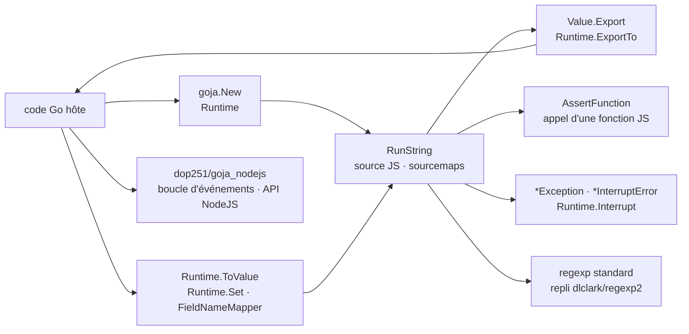

# dop251/goja

> **A JavaScript interpreter in pure Go, to make a Go application scriptable without cgo.**

## The problem

Running JavaScript from a Go program usually means wrapping V8, which means cgo: awkward cross
compilation, a native dependency to ship, and above all a boundary-crossing cost on every call
between Go and the script. When the Go side drives the work and calls into the script often,
passing complex data structures, that crossing cost cancels out the gain of a faster engine.

## What it actually does

Goja implements ECMAScript 5.1 in pure Go — regex and strict mode included — with an emphasis on
standard compliance: the README states it passes nearly all tc39/test262 tests for the features
implemented so far, the goal being to pass all of them. Much of ES6 is there, still work in
progress, tracked in a repository milestone. The README claims Babel and the TypeScript compiler
run on it.

On the integration side the surface is that of an embedded VM: `goja.New()` creates a `Runtime`,
`RunString` evaluates, `ToValue` brings any Go value into the script, `Export` and `ExportTo`
bring values back out — with the guarantee that within a single export operation the same JS
object maps to the same Go value, which makes circular objects exportable. JS functions are
called from Go either through `AssertFunction` (you control `this`) or through `ExportTo` into a
Go `func`. A `FieldNameMapper` (`TagFieldNameMapper`, `UncapFieldNameMapper`) reconciles
capitalised Go field names with JavaScript naming conventions. JS exceptions surface as
`*Exception`, whose `Value()` returns the thrown value; conversely, a Go function that panics
with a `Value` raises a JS exception that script code can catch. `Interrupt` halts a running
script and yields an `*InterruptError`: the README's infinite loop is cut after 200 ms.
Sourcemaps are supported. Regular expressions use the standard library `regexp` where possible,
falling back to `dlclark/regexp2`.

## How it is wired



No code-derived diagram exists for this repository: this one is reconstructed from the README
alone, from the API names it cites. The point is that everything goes through a single,
single-goroutine `Runtime`, and that the event loop is not in that node but in a separate
project.

## Trying it

The README gives no shell command at all — no install, no build, no test invocation. It documents
Go code only. The minimal example, copied verbatim:

```go
vm := goja.New()
v, err := vm.RunString("2 + 2")
if err != nil {
    panic(err)
}
if num := v.Export().(int64); num != 4 {
    panic(num)
}
```

And calling a JS function from Go, also copied from the README:

```go
sum, ok := goja.AssertFunction(vm.Get("sum"))
if !ok {
    panic("Not a function")
}

res, err := sum(goja.Undefined(), vm.ToValue(40), vm.ToValue(2))
```

The README states the minimum required Go version, 1.25, and points to the API documentation on
pkg.go.dev.

## Cost and traps

- **Go 1.25 minimum**: the only environment constraint announced, but a recent one that may block
  a codebase pinned to an older toolchain.
- **Not goroutine-safe.** The README is explicit: a `Runtime` instance can only be used by one
  goroutine at a time, and object values cannot be passed between runtimes. Each isolate really is
  isolated — serialising access is the host's job.
- **`JSON.parse()` relies on the Go standard library**, which works in UTF-8: broken UTF-16
  surrogate pairs are not parsed correctly — the README's example returns `"fffd"` where the
  specification requires `"d800"`.
- **`Date` converts through the Go standard library**, which uses `int` rather than `float` as the
  specification requires: arguments overflowing `int`, or an integer overflow, give a wrong
  result, with an example in the README.
- **Some AnnexB functionality is missing**, and ES6 is ongoing: work happens in feature branches
  merged when appropriate, and the README warns that the tc39 test version used is quite old, so
  that part is less well tested than ES5.1.
- **No ETAs.** The maintainer explicitly asks not to be asked for them, and asks that fixes be
  discussed before being submitted. The real cost: the pace of the missing features is not
  negotiable.

## What it is not

- **Not a replacement for V8 or SpiderMonkey.** The README says so itself: faster than most
  scripting language implementations in Go — six to seven times otto on average — but not a
  general-purpose JavaScript engine. If most of the work happens *inside* the script (crypto,
  heavy calculation), V8 remains the right choice.
- **Not a browser- or NodeJS-style runtime**: no `setTimeout`, no `setInterval`, no event loop —
  those functions are not part of the ECMAScript standard and the hosting application must supply
  the concurrency model. `dop251/goja_nodejs`, a separate project, provides some of it.
- **Not an advertised security sandbox.** The README mentions "much better control over execution
  environment", useful for research, but nowhere claims isolation against hostile code.
  `Interrupt` cuts an infinite loop; nothing beyond that is documented.
- **Not full ECMAScript coverage**: ES5.1 yes, ES6 partially, beyond that no.

## Alternatives

| | When to prefer it |
|---|---|
| **robertkrimen/otto** | Named in the README as the project's inspiration. Same principle — a JavaScript interpreter in pure Go — but goja claims six to seven times its speed on average. Worth preferring only for a codebase already wired to it. |
| **dop251/goja_nodejs** | A separate project by the same author, named twice in the README: adds an event loop and part of the NodeJS API. To take *alongside* goja as soon as `setTimeout` or NodeJS modules are needed, not instead of it. |
| **dlclark/regexp2** | Named as the fallback dependency for regular expressions the standard `regexp` cannot handle. Not an alternative to goja, but the brick that explains its regex behaviour. |

The catalogue line offers no neighbours for this repository: the comparison above rests only on
the projects named in the README.

## For you

The use case that matters for a data / AI / MLOps profile is not "writing JavaScript", it is
making a Go binary configurable: transformation rules, filters, routing policies written as
scripts by a user and evaluated without recompiling or shipping a native dependency. That the
whole thing stays pure Go — trivial cross compilation, a single binary — counts for more here
than script execution speed. Skip it if the script is where the heavy computation lives, or if
untrusted third-party code must be executed: the README promises neither.
