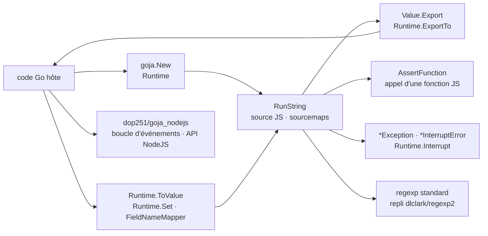

# dop251/goja

> **Un interpréteur JavaScript en Go pur, pour faire scripter une application Go sans cgo.**

## Le problème

Faire exécuter du JavaScript par un programme Go passe d'ordinaire par un enrobage de V8, donc
par cgo : compilation croisée compliquée, dépendance native à embarquer, et surtout un coût de
franchissement de frontière à chaque appel entre Go et le script. Quand c'est le moteur Go qui
mène la danse et que le script est appelé souvent avec des structures de données complexes, ce
coût de passage annule le gain d'un moteur rapide.

## Ce que ça fait vraiment

Goja implémente ECMAScript 5.1 en Go pur — regex et mode strict compris — et vise la conformité
au standard : le README annonce que le projet passe presque tous les tests tc39/test262 pour ce
qui est implémenté, l'objectif étant de tous les passer. Une bonne partie d'ES6 est là, encore en
cours, suivie dans un jalon du dépôt. Le README affirme que Babel et le compilateur TypeScript
tournent dessus.

Côté intégration, la surface est celle d'une VM embarquée : `goja.New()` crée un `Runtime`,
`RunString` évalue, `ToValue` fait entrer n'importe quelle valeur Go dans le script, `Export` et
`ExportTo` la font ressortir — avec la garantie qu'au sein d'une même exportation un même objet
JS est représenté par la même valeur Go, ce qui permet d'exporter des objets circulaires. Les
fonctions JS s'appellent depuis Go par `AssertFunction` (on maîtrise `this`) ou par `ExportTo`
vers un `func` Go. Un `FieldNameMapper` (`TagFieldNameMapper`, `UncapFieldNameMapper`) réconcilie
les noms de champs Go capitalisés avec la convention JavaScript. Les exceptions JS remontent en
`*Exception` dont `Value()` donne la valeur levée ; réciproquement, une fonction Go qui panique
avec une `Value` lève une exception rattrapable en JS. `Interrupt` arrête un script en cours et
produit une `*InterruptError` : la boucle infinie de l'exemple du README est coupée au bout de
200 ms. Les sourcemaps sont prises en charge. Les regex utilisent le `regexp` de la bibliothèque
standard quand c'est possible, avec repli sur `dlclark/regexp2`.

## Comment c'est branché



Aucun diagramme tiré du code n'existe pour ce dépôt : ce schéma est reconstruit depuis le seul
README, à partir des noms d'API qu'il cite. Le point à retenir est que tout passe par un
`Runtime` unique, mono-goroutine, et que la boucle d'événements n'est pas dans ce nœud-là mais
dans un projet séparé.

## Essayer

Le README ne donne aucune commande shell — ni installation, ni construction, ni tests. Il ne
documente que du code Go. L'exemple minimal, copié tel quel :

```go
vm := goja.New()
v, err := vm.RunString("2 + 2")
if err != nil {
    panic(err)
}
if num := v.Export().(int64); num != 4 {
    panic(num)
}
```

Et l'appel d'une fonction JS depuis Go, également copié du README :

```go
sum, ok := goja.AssertFunction(vm.Get("sum"))
if !ok {
    panic("Not a function")
}

res, err := sum(goja.Undefined(), vm.ToValue(40), vm.ToValue(2))
```

Le README indique la version minimale de Go requise, 1.25, et renvoie la documentation d'API sur
pkg.go.dev.

## Coût et pièges

- **Go 1.25 minimum** : c'est la seule contrainte d'environnement annoncée, mais elle est récente
  et peut bloquer une base de code figée sur une version plus ancienne.
- **Aucune sécurité de goroutine.** Le README est net : une instance de `Runtime` ne peut être
  utilisée que par une goroutine à la fois, et il est impossible de faire circuler des valeurs
  d'objets entre deux runtimes. Chaque isolat est donc vraiment isolé — à la charge de l'hôte de
  sérialiser les accès.
- **`JSON.parse()` s'appuie sur la bibliothèque Go**, qui travaille en UTF-8 : les paires de
  substitution UTF-16 cassées ne sont pas analysées correctement — l'exemple du README donne
  `"fffd"` là où le standard veut `"d800"`.
- **`Date` convertit via la bibliothèque Go**, qui utilise `int` et non `float` comme le veut la
  spécification : arguments qui débordent l'`int` ou dépassement d'entier donnent un résultat
  faux, exemple à l'appui dans le README.
- **De l'AnnexB manque**, et ES6 est en cours : le travail se fait dans des branches de
  fonctionnalité fusionnées quand elles sont prêtes, et le README prévient que la version des
  tests tc39 utilisée est ancienne, donc cette partie est moins éprouvée que l'ES5.1.
- **Pas d'ETA.** Le mainteneur demande explicitement de ne pas en réclamer, et de discuter avant
  de soumettre un correctif. Coût réel : le rythme des fonctionnalités manquantes ne se négocie
  pas.

## Ce que ce n'est pas

- **Ce n'est pas un remplaçant de V8 ou SpiderMonkey.** Le README le dit lui-même : plus rapide
  que la plupart des implémentations de langages de script en Go — six à sept fois otto en
  moyenne — mais pas un moteur JavaScript généraliste. Si le gros du travail se fait *dans* le
  script (crypto, calcul lourd), V8 reste le bon choix.
- **Ce n'est pas un environnement d'exécution façon navigateur ou NodeJS** : ni `setTimeout`, ni
  `setInterval`, ni boucle d'événements — ces fonctions ne sont pas dans le standard ECMAScript
  et c'est à l'application hôte de fournir le modèle de concurrence. `dop251/goja_nodejs`, projet
  séparé, en propose une partie.
- **Ce n'est pas un bac à sable de sécurité annoncé comme tel.** Le README parle de « meilleur
  contrôle de l'environnement d'exécution », utile pour la recherche, mais ne revendique nulle
  part une isolation face à du code hostile. `Interrupt` coupe une boucle infinie ; rien de plus
  n'est documenté.
- **Ce n'est pas une couverture ECMAScript complète** : ES5.1 oui, ES6 partiellement, au-delà non.

## Alternatives

| | Quand le préférer |
|---|---|
| **robertkrimen/otto** | Cité dans le README comme l'inspiration du projet. Même principe — interpréteur JavaScript en Go pur — mais goja se donne pour six à sept fois plus rapide en moyenne. À ne préférer que pour une base de code déjà branchée dessus. |
| **dop251/goja_nodejs** | Projet séparé du même auteur, nommé deux fois dans le README : ajoute une boucle d'événements et une partie de l'API NodeJS. À prendre *en plus* de goja dès qu'on a besoin de `setTimeout` ou de modules NodeJS, pas à la place. |
| **dlclark/regexp2** | Nommée comme dépendance de repli pour les expressions régulières que le `regexp` standard ne couvre pas. Pas une alternative à goja, mais la brique qui explique son comportement sur les regex. |

La ligne du catalogue ne propose aucun voisin pour ce dépôt : la comparaison ci-dessus ne
s'appuie que sur les projets nommés dans le README.

## Pour toi

Le cas d'usage qui vaut pour un profil data / IA / MLOps n'est pas « faire du JavaScript », c'est
rendre configurable un binaire Go : règles de transformation, filtres, politiques d'aiguillage
écrites en script par un utilisateur et évaluées sans recompiler ni embarquer de dépendance
native. Le fait que l'ensemble reste du Go pur — compilation croisée triviale, un seul binaire —
compte plus ici que la vitesse d'exécution du script. À écarter si le script est le lieu du
calcul lourd, ou s'il faut exécuter du code tiers non fiable : le README ne promet ni l'un ni
l'autre.
