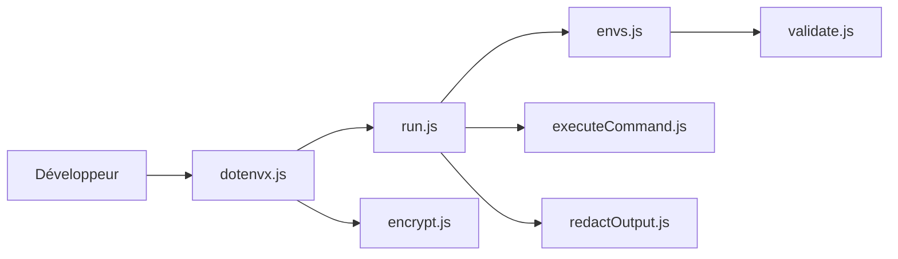

# dotenvx/dotenvx

> Chargeur de fichiers .env chiffrés et multi-environnements, utilisable avec n'importe quel langage.

## Le problème
Les fichiers `.env` en clair traînent dans les dépôts, et chaque langage a son propre chargeur incompatible.

## Ce que ça fait vraiment
`dotenvx run -- commande` injecte les variables dans le processus, quel que soit le langage. `encrypt` chiffre le `.env` (clés publique/privée secp256k1) ; la clé privée va dans `.env.keys`, le trousseau de l'OS ou 1Password. Gère plusieurs fichiers, conventions Next.js/flow, validation par `Envfile`, `--redact` pour masquer les secrets dans la sortie d'agents (Claude, Codex, Cursor), `precommit` et `prebuild`. Armor est une option hébergée.

## Comment c'est branché


## Essayer
```bash
npm install @dotenvx/dotenvx --save
dotenvx encrypt
dotenvx run -- node index.js
dotenvx run --redact -- claude -p 'Print the value of $SECRET'
```

## Coût et pièges
Gratuit ; Armor (gardiennage des clés) est un service tiers à compte. Sur Linux, le trousseau exige `secret-tool` et une session D-Bus. Garde une copie de la clé privée : sa perte rend les secrets illisibles.

## Ce que ce n'est pas
Pas un coffre de secrets d'entreprise. Deno n'est pas pris en charge avec le module npm directement. `--redact` ne masque que les valeurs exactes.

## Alternatives
dotenv : projet d'origine du même auteur, sans chiffrement.

## Pour toi
Adopter : chiffrer les `.env` des pipelines et masquer les secrets dans les sorties d'agents, avec un seul outil pour tous les langages.

