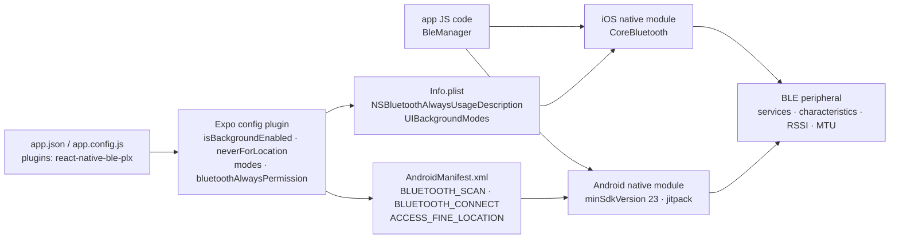

# dotintent/react-native-ble-plx

> **The Bluetooth Low Energy bridge for React Native apps, central role, iOS and Android.**

## The problem

Talking to a BLE sensor from a React Native app means writing the same code twice — CoreBluetooth
on iOS, the Android Bluetooth API on Android — then exposing it to JavaScript, with permissions
that changed three times (Android 12, Android 14, iOS 13) and an adapter lifecycle to watch by hand.

## What it actually does

The library exposes a `BleManager` on the JavaScript side and implements the rest natively. The
README spells out the covered surface: observing the Bluetooth adapter state, scanning devices,
connecting to peripherals, discovering services and characteristics, reading and writing
characteristics, subscribing to notifications and indications, reading RSSI, negotiating MTU,
background mode on iOS, and turning the adapter on.

It also ships an Expo config plugin (SDK 43+) that writes the native entries itself:
`isBackgroundEnabled` adds the BLE `uses-feature` to `AndroidManifest.xml`, `neverForLocation`
sets that flag on `BLUETOOTH_SCAN` (Android SDK 31+), `modes` adds iOS `UIBackgroundModes` to
`Info.plist`, and `bluetoothAlwaysPermission` writes the `NSBluetoothAlwaysUsageDescription`
message there. The README also lists what is **not** covered: Bluetooth classic, the peripheral
role (phone-to-phone), bonding, and beacons.

Version 3.2.0 turned `destroyClient`, `cancelTransaction`, `setLogLevel`, `startDeviceScan` and
`stopDeviceScan` into promises so Android errors surface in JavaScript, and added an Android
instance check before each call.

## How it is wired

No code-derived diagram exists for this repository; the graph below is rebuilt from the README
alone, using the file names it cites.



## Trying it

```bash
npm install --save react-native-ble-plx
```

On the Expo path, add the plugin to `app.json` and rebuild:

```bash
npx expo install react-native-ble-plx
npx expo prebuild
npx expo run:android
```

```json
{
  "expo": {
    "plugins": ["react-native-ble-plx"]
  }
}
```

On the bare iOS path the README asks you to enter the `ios` folder and run `pod update`, then add
`NSBluetoothAlwaysUsageDescription` to `info.plist`. On Android, raise `minSdkVersion` to at least
23, add the `maven { url 'https://www.jitpack.io' }` repository, and declare the Bluetooth
permissions in the manifest. No sample run command is documented in the README.

## Cost and gotchas

- **Free, Apache-2.0, no API key, no third-party service.** The cost is native configuration time,
  not a bill.
- **Not usable in Expo Go**: the README states the package requires custom native code, so you need
  `prebuild` and a development build.
- **Every plugin prop change forces a rebuild** (and another `prebuild`), which makes the iteration
  loop slow.
- **`neverForLocation` is flagged experimental** by the README — an all-caps warning that BLE might
  not work, to be tested before release; it also filters some BLE beacons out of scan results.
- **Shifting permissions**: `BLUETOOTH_SCAN` and `BLUETOOTH_CONNECT` for Android 12+, `BLUETOOTH`
  and `BLUETOOTH_ADMIN` capped at `maxSdkVersion="30"` below it, `ACCESS_FINE_LOCATION` still
  required on older Android.
- **Narrow declared compatibility**: the table validates 3.1.2 against React Native 0.74.1, 0.69.6
  and Expo 51, and the changelog excerpt stops at 3.2.0. Newer React Native versions are not
  covered by this README — the reason for the staleness flag.
- **Below React Native 0.60** you must switch to `docs/README_V1.md` and the migration guide
  `docs/MIGRATION_V1.md`.
- **The README's Troubleshooting section is empty**: real support lives in the online docs and wiki.

## What it is not

- **Not a full Bluetooth stack**: no Bluetooth classic, so no audio and no serial port; no
  peripheral role, so no phone-to-phone communication.
- **Not a bonding manager nor a beacon library**: both are explicitly listed as unsupported, each
  pointing at a wiki page.
- **Not a way to avoid native work**: the Expo plugin writes native files for you, but you still
  compile, sign and test on a real device — a simulator has no BLE radio.

## Alternatives

No comparable alternative in the catalogue: the suggested neighbours (`kean/Nuke`, image loading on
iOS; `groue/GRDB.swift`, SQLite in Swift; `tetherto/qvac`) have nothing to do with Bluetooth Low
Energy in React Native. The README names no competing library; it only points to
`Cierpliwy/SensorTag` as an iOS and Android setup example, which is a demo app, not a substitute.

## For you

Skip it if your ground is data or MLOps: nothing here touches training, model serving or pipelines.
The one reason to open it is having to collect BLE sensor readings from a mobile app — a real IoT
case, but a marginal one; worth watching rather than adopting, all the more so since the declared
compatibility stops at already-old React Native versions.
