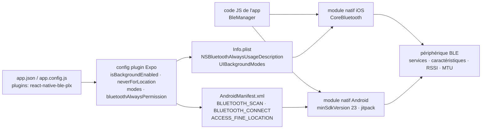

# dotintent/react-native-ble-plx

> **Le pont Bluetooth Low Energy des applications React Native, côté central, iOS et Android.**

## Le problème

Parler à un capteur BLE depuis une application React Native suppose d'écrire deux fois le même
code natif — CoreBluetooth côté iOS, l'API Bluetooth d'Android côté Android — puis de l'exposer
au JavaScript, avec des permissions qui ont changé trois fois (Android 12, Android 14, iOS 13)
et un cycle de vie d'adaptateur à surveiller à la main.

## Ce que ça fait vraiment

La bibliothèque expose un `BleManager` côté JavaScript et implémente le reste en natif. Le
README énumère précisément la surface couverte : observer l'état de l'adaptateur Bluetooth,
scanner les appareils, se connecter aux périphériques, découvrir services et caractéristiques,
lire et écrire des caractéristiques, s'abonner aux notifications et indications, lire le RSSI,
négocier le MTU, activer le mode arrière-plan sur iOS et allumer l'adaptateur de l'appareil.

Elle fournit aussi un *config plugin* Expo (SDK 43+) qui écrit lui-même les entrées natives :
`isBackgroundEnabled` ajoute la `uses-feature` BLE à l'`AndroidManifest.xml`, `neverForLocation`
pose le drapeau du même nom sur `BLUETOOTH_SCAN` (Android SDK 31+), `modes` ajoute les
`UIBackgroundModes` iOS au `Info.plist`, `bluetoothAlwaysPermission` y écrit le message de
`NSBluetoothAlwaysUsageDescription`. Le README liste par ailleurs ce qui n'est **pas** couvert :
Bluetooth classique, rôle périphérique (téléphone à téléphone), *bonding*, balises.

La version 3.2.0 a converti `destroyClient`, `cancelTransaction`, `setLogLevel`,
`startDeviceScan` et `stopDeviceScan` en promesses, pour que les erreurs Android remontent
jusqu'au JavaScript ; une vérification de l'instance Android précède désormais chaque appel.

## Comment c'est branché

Aucun diagramme tiré du code n'existe pour ce dépôt ; ce schéma est reconstruit depuis le seul
README, à partir des noms de fichiers qu'il cite.



## Essayer

```bash
npm install --save react-native-ble-plx
```

Puis, sur le chemin Expo, ajouter le plugin à `app.json` et reconstruire :

```bash
npx expo install react-native-ble-plx
npx expo prebuild
npx expo run:android
```

```json
{
  "expo": {
    "plugins": ["react-native-ble-plx"]
  }
}
```

Sur le chemin iOS sans Expo, le README demande d'entrer dans le dossier `ios` et de lancer
`pod update`, puis d'ajouter `NSBluetoothAlwaysUsageDescription` à l'`info.plist`. Côté Android,
il faut porter `minSdkVersion` à 23 au moins, ajouter le dépôt
`maven { url 'https://www.jitpack.io' }` et déclarer les permissions Bluetooth dans le
manifeste. Aucune commande d'exécution d'exemple n'est documentée dans le README.

## Coût et pièges

- **Gratuit, licence Apache-2.0, aucune clé d'API, aucun service tiers.** Le coût est du temps
  de configuration native, pas de la facture.
- **Incompatible avec Expo Go** : le README le dit explicitement, le paquet exige du code natif
  personnalisé. Il faut passer par `prebuild` et un *development build*.
- **Chaque changement de props du plugin impose de reconstruire** (et de refaire `prebuild`) :
  la boucle d'itération est longue.
- **`neverForLocation` est signalé comme expérimental** par le README — avertissement en
  majuscules, « BLE might not work », à tester avant mise en production ; et il filtre certaines
  balises BLE des résultats de scan.
- **Permissions mouvantes** : `BLUETOOTH_SCAN` et `BLUETOOTH_CONNECT` pour Android 12+,
  `BLUETOOTH` et `BLUETOOTH_ADMIN` plafonnés à `maxSdkVersion="30"` en dessous,
  `ACCESS_FINE_LOCATION` encore requise sur les Android anciens.
- **Fenêtre de compatibilité affichée étroite** : le tableau du README valide la version 3.1.2
  contre React Native 0.74.1, 0.69.6 et Expo 51, et les « Recent Changes » s'arrêtent à 3.2.0.
  Les versions plus récentes de React Native ne sont pas couvertes par ce README — c'est ce qui
  motive l'alerte.
- **En dessous de React Native 0.60**, il faut basculer sur `docs/README_V1.md` et le guide de
  migration `docs/MIGRATION_V1.md`.
- **La section « Troubleshooting » du README est vide** : le support réel passe par la
  documentation en ligne et le wiki.

## Ce que ce n'est pas

- **Ce n'est pas une pile Bluetooth complète** : pas de Bluetooth classique, donc ni audio ni
  port série ; pas de rôle périphérique, donc pas de communication de téléphone à téléphone.
- **Ce n'est pas un gestionnaire d'appairage ni une bibliothèque de balises** : *bonding* et
  beacons sont explicitement listés comme non supportés, chacun renvoyé à une page de wiki.
- **Ce n'est pas un raccourci qui évite le natif** : le plugin Expo écrit les fichiers natifs à
  votre place, mais il faut toujours compiler, signer et tester sur appareil réel — un simulateur
  n'a pas de radio BLE.

## Alternatives

Aucune alternative comparable dans le catalogue : les voisins proposés (`kean/Nuke`, chargement
d'images sur iOS ; `groue/GRDB.swift`, SQLite en Swift ; `tetherto/qvac`) ne touchent pas au
Bluetooth Low Energy en React Native. Le README ne nomme pas de bibliothèque concurrente ; il
renvoie seulement à `Cierpliwy/SensorTag` comme exemple de mise en place iOS et Android, ce qui
est une application de démonstration et non un substitut.

## Pour toi

Passe ton chemin si ton terrain est la donnée ou le MLOps : rien ici ne concerne l'entraînement,
le service de modèles ou les pipelines. La seule raison de l'ouvrir est d'avoir à collecter des
mesures de capteurs BLE depuis une application mobile — cas d'usage IoT réel, mais marginal ; à
garder sous surveillance plutôt qu'à adopter, d'autant que la compatibilité annoncée s'arrête à
des versions de React Native déjà anciennes.
