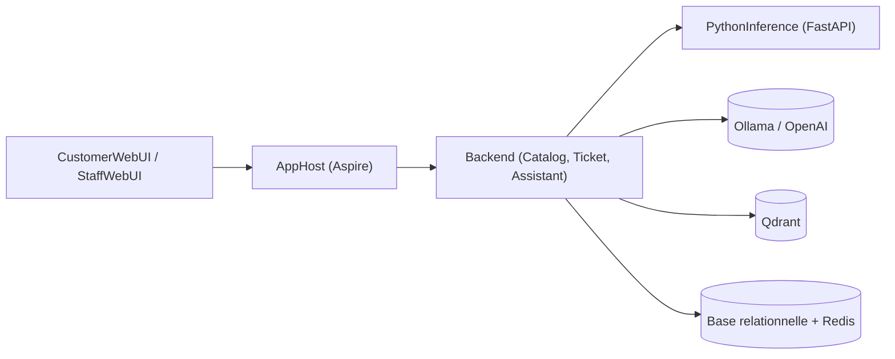

# dotnet/eShopSupport

> Application de démonstration .NET Aspire de support client avec IA générative : classification, résumé, chatbot.

## Le problème
Montrer comment intégrer du texte génératif (classification, analyse de sentiment, résumé, assistant) à une application .NET de bout en bout.

## Ce que ça fait vraiment
D'après le code : AppHost orchestre des API (Catalogue, Tickets, Assistant, messagerie), deux interfaces Blazor (client et personnel), un fournisseur d'identité et un service Python d'inférence (embeddings, classification). L'assistant appelle OpenAI ou un modèle local via Ollama ; Qdrant sert la recherche vectorielle, Redis la messagerie temps réel. Un évaluateur teste les réponses. Les données d'exemple sont fictives, générées par GPT-3.5.

## Comment c'est branché


## Essayer
```bash
dotnet workload update
dotnet workload install aspire
dotnet restore eShopSupport.sln
pip install -r src/PythonInference/requirements.txt
dotnet run --project src/AppHost
```

## Coût et pièges
Le README demande un GPU Nvidia (contournement CPU mentionné sans détail), Docker Desktop, Python 3.12.5 et le SDK .NET 8. Le dernier push date de mai 2025.

## Ce que ce n'est pas
Ce n'est pas un produit de support : c'est une démonstration, dont le déploiement cloud est seulement prévu. Le dépôt n'a pas bougé depuis plus d'un an.

## Alternatives
Le README ne cite aucune alternative.

## Pour toi
À surveiller : bon exemple d'architecture RAG/LLM avec évaluation dans un écosystème .NET, mais figé depuis mai 2025 et lourd à lancer.

