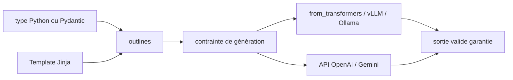

# dottxt-ai/outlines

> Impose la structure d'une sortie LLM pendant la génération, pas après.

## Le problème
Réparer une sortie de LLM après coup — parsing, regex, retries — casse dès que le
modèle change de format.

## Ce que ça fait vraiment
On passe le type voulu en second argument : `model(prompt, output_type)`. Un
`Literal["Yes","No"]` pour un choix, `int` pour un nombre, un modèle Pydantic pour
un objet, une signature de fonction pour du function calling, une regex ou une
grammaire pour le reste. Le même code tourne sur transformers, llama.cpp, vLLM,
Ollama, OpenAI, Gemini et Dottxt. `outlines.Template.from_string` et
`from_file` séparent les prompts du code, avec syntaxe Jinja. Les types union
permettent au modèle de répondre une structure ou `"I don't know"`.

## Comment c'est branché


## Essayer
```bash
pip install outlines
```

## Coût et pièges
Gratuit côté bibliothèque. Les exemples chargent des modèles locaux
(`microsoft/Phi-3-mini-4k-instruct`, `microsoft/phi-4`) avec `device_map="auto"` :
GPU fortement conseillé. Sur les backends API, la contrainte ne peut s'appliquer
qu'à ce que le fournisseur expose. Les sorties sont des chaînes JSON à repasser par
`model_validate_json`.

## Ce que ce n'est pas
Ce n'est pas un garde-fou sémantique : la structure est garantie, pas la justesse du
contenu. Ce n'est pas un framework d'agent. La société .txt vend en parallèle des
bibliothèques d'entreprise et propose un audit de schéma — le dépôt open source
n'est pas toute l'offre.

## Alternatives
- Aucun dépôt alternatif nommé dans le README.

## Pour toi
La brique à mettre sous tout pipeline d'extraction ou de classification par LLM.
Le papier « Efficient Guided Generation » est cité pour la méthode.
