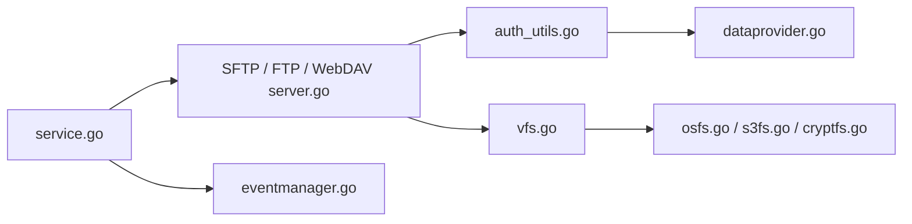

# drakkan/sftpgo

> Serveur de transfert de fichiers événementiel (SFTP, FTP/S, WebDAV, HTTP/S) avec stockages locaux ou cloud.

## Le problème
Échanger des fichiers avec des partenaires via des protocoles standards, en les stockant en local ou sur S3, GCS, Azure.

## Ce que ce n'est pas
Pas un simple serveur SFTP : un système de comptes, politiques, partages publics, MFA et automatisations. Les fonctions avancées (archivage intelligent, IMAP, PGP, antivirus/DLP, édition) sont réservées à l'édition Enterprise.

## Ce que ça fait vraiment
Serveurs SFTP, FTP/S, HTTP/S, WebDAV ; interfaces WebAdmin et WebClient ; API REST ; gestionnaire d'événements ; système de fichiers virtuel vers local, chiffré, S3, GCS, Azure ou autre SFTP.

## Comment c'est branché

## Essayer
Le README ne donne aucune commande d'installation : il renvoie à docs.sftpgo.com (édition Community).

## Coût et pièges
Community AGPL-3.0 gratuite ; Enterprise sous licence commerciale. La cadence des nouveautés est plus rapide côté Enterprise.

## Alternatives
Aucune alternative nommée dans le README.

## Pour toi
À surveiller : bonne brique pour déposer des données vers un bucket S3, mais l'AGPL et le modèle à deux éditions imposent de vérifier que tu n'as pas besoin des fonctions payantes.

