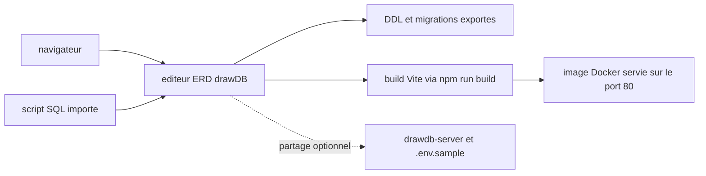

# drawdb-io/drawdb

> **Browser-based database schema editor that emits SQL, no account required.**

## The problem

Drawing an entity-relationship model usually means a desktop tool, a vendor account, or a
diagram file no SQL engine can read back. Going from the drawing to DDL and then to migrations
is redone by hand at every iteration.

## What it actually does

The README describes an ERD editor running entirely in the browser: build diagrams by clicking,
**import and export SQL scripts**, **generate migrations**, and customize the editor. No account
is needed. Sharing is the only feature that leaves the browser: it requires a separate server,
`drawdb-io/drawdb-server`, plus environment variables modelled on `.env.sample`, and the README
calls it optional. The full feature list is not in the README; it points to drawdb.app.

## How it is wired



The README only covers the surface: a front-end web app started with `npm run dev`, bundled by
`npm run build`, and packageable as a Docker image exposed on port 80. SQL flows in and out of
the editor; the sharing server is a separate component in another repository and is not needed
for local use. No code-derived diagram exists for this repo, so the graph above is inferred from
the README alone.

## Trying it

```bash
git clone https://github.com/drawdb-io/drawdb
cd drawdb
npm install
npm run dev
```

```bash
docker build -t drawdb .
docker run -p 3000:80 drawdb
```

## Cost and traps

Nothing to pay and no API key: you need Node and npm, or Docker for the container route. The
trap is the licence: **AGPL-3.0**, network copyleft — hosting a modified version for third
parties obliges you to publish the sources, which matters for corporate internal use. Second,
sharing means deploying and maintaining a second service. Third, the README defers the feature
list to the hosted site, so what the self-hosted build actually includes is not documented here.

## What it is not

It is not a database or a SQL client: nothing indicates it connects to an engine to read an
existing schema or run a query — it produces and reads scripts. It is not a migration tool in
the Alembic or Flyway sense either: it *generates* migrations, but the README says nothing about
applying, versioning or replaying them. And it is not collaborative out of the box: sharing is an
option that assumes a separate server you install yourself.

## Alternatives

- `dolthub/dolt` — if the need is real versioning of data and schema rather than drawing.
- `clidey/whodb` — if you want to browse and query an existing database instead of modelling from scratch.
- `Canner/WrenAI` — if the goal is natural-language querying, a very different angle.

None of the three does the same job: drawDB is the only one of the set aimed at ERD design.

## For you

Handy occasionally to lay out a clean data model before building a warehouse or a feature store,
and to get the DDL out without leaving the browser. It is not a pipeline tool: keep it nearby,
not in the MLOps chain. The AGPL question must be settled before any self-hosting at work.
