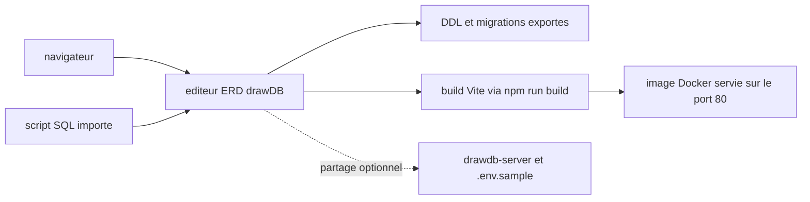

# drawdb-io/drawdb

> **Éditeur de schémas de bases dans le navigateur, qui recrache du SQL, sans compte.**

## Le problème

Dessiner un modèle entité-association demande d'ordinaire un outil de bureau, un compte chez
un éditeur, ou un fichier de diagramme qu'aucun moteur SQL ne relit. Et le passage du dessin
au DDL, puis aux migrations, se refait à la main à chaque itération.

## Ce que ça fait vraiment

Le README annonce un éditeur d'ERD qui tourne entièrement dans le navigateur : on construit le
diagramme à la souris, on **importe et exporte des scripts SQL**, on **génère des migrations**,
et on personnalise l'éditeur. Aucune création de compte n'est demandée. Le partage de fichiers
est la seule fonction qui sort du navigateur : il réclame un serveur séparé,
`drawdb-io/drawdb-server`, et des variables d'environnement calquées sur `.env.sample` ; le
README le présente comme optionnel. La liste complète des fonctions n'est pas dans le README,
elle renvoie au site drawdb.app.

## Comment c'est branché



Le README ne décrit que la surface : une application web front-end lancée par `npm run dev`,
empaquetée par `npm run build`, et emballable dans une image Docker exposée en 80. Le SQL entre
et sort de l'éditeur ; le serveur de partage est une brique distincte, dans un autre dépôt, et
n'est pas nécessaire au fonctionnement local. Aucun diagramme tiré du code n'existe ici, ce
schéma est déduit du seul README.

## Essayer

```bash
git clone https://github.com/drawdb-io/drawdb
cd drawdb
npm install
npm run dev
```

```bash
docker build -t drawdb .
docker run -p 3000:80 drawdb
```

## Coût et pièges

Rien à payer et aucune clé d'API : il faut Node et npm, ou Docker pour la voie conteneur.
Le piège est ailleurs : la licence est **AGPL-3.0**, donc copyleft réseau — héberger une
version modifiée pour des tiers oblige à en publier les sources, ce qui pèse pour un usage
interne d'entreprise. Second point, le partage impose de déployer et maintenir un second
service. Enfin le README renvoie au site hébergé pour la liste des fonctions : ce que fait
exactement la version qu'on auto-héberge n'est pas documenté ici.

## Ce que ce n'est pas

Ce n'est pas une base de données ni un client SQL : rien n'indique qu'il se connecte à un
moteur pour lire un schéma existant ou exécuter une requête — il produit et lit des scripts.
Ce n'est pas non plus un outil de migration au sens d'Alembic ou Flyway : il *génère* des
migrations, mais rien dans le README ne parle de les appliquer, de les versionner ou de les
rejouer. Et ce n'est pas collaboratif en l'état : le partage est une option qui suppose un
serveur tiers à installer soi-même.

## Alternatives

- `dolthub/dolt` — si le besoin est le versionnage réel des données et du schéma, pas le dessin.
- `clidey/whodb` — si l'on veut explorer et interroger une base existante plutôt que modéliser à vide.
- `Canner/WrenAI` — si l'objectif est d'interroger la donnée en langage naturel, angle très différent.

Aucun de ces trois ne fait la même chose : drawDB reste le seul du lot orienté conception d'ERD.

## Pour toi

Utile ponctuellement pour poser un modèle de données propre avant de monter un entrepôt ou un
schéma de features, et pour en sortir le DDL sans quitter le navigateur. Ce n'est pas un outil
de pipeline : à garder sous la main, pas à mettre dans la chaîne MLOps. L'AGPL doit être
tranchée avant tout auto-hébergement en contexte pro.
