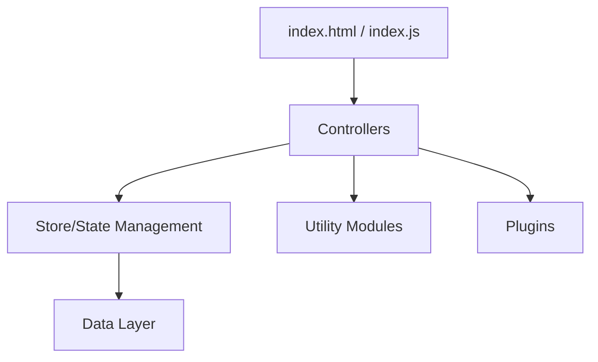

# dream-num/Luckysheet

> Tableur web de type Excel en JavaScript, à intégrer dans une page. Il est archivé.

## Le problème
Intégrer un tableur complet (formules, tableaux croisés, graphiques) dans une application web demande beaucoup de travail.

## Ce que ça fait vraiment
Il gère la mise en forme conditionnelle, les formules, le tri et le filtre, les tableaux croisés, les graphiques et les commentaires.
Il prévoit l'édition collaborative et l'import/export Excel via Luckyexcel.
On l'intègre par CDN avec `luckysheet.create({container})`, jQuery requis.

## Comment c'est branché


## Essayer
```bash
npm install
npm install gulp -g
npm run dev
npm run build
```

## Coût et pièges
Il est gratuit, mais le dépôt est archivé : aucune correction, même de sécurité. Pour l'import, l'export et l'impression, le README renvoie à Univer.

## Ce que ce n'est pas
Ce n'est pas un projet maintenu. Ce n'est pas un outil d'analyse de données.

## Alternatives
- Univer (même éditeur) : c'est le successeur désigné par le README.

## Pour toi
À ignorer : le dépôt est archivé et c'est un composant front hors de ton périmètre. S'il te faut un jour un tableur web, regarde Univer.
