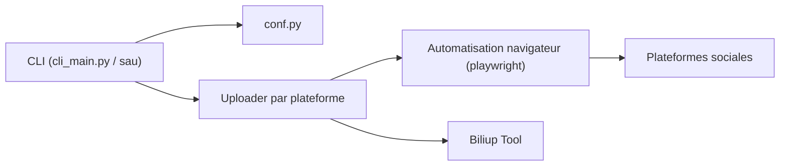

# dreammis/social-auto-upload

> Outil en ligne de commande qui publie des vidéos en série sur des plateformes sociales chinoises et internationales.

## Le problème
Publier la même vidéo sur plusieurs réseaux (Douyin, Bilibili, Xiaohongshu, YouTube…) à la main est répétitif et chronophage.

## Ce que ça fait vraiment
Une CLI `sau` pilote un navigateur automatisé pour se connecter (cookies par compte), téléverser une vidéo ou une note (titre, description, tags) et programmer la publication. Un module par plateforme (`uploader/`) ; Bilibili passe par `biliup` téléchargé automatiquement. Le projet est en pleine refonte (passage à `patchright`, mode sans fenêtre, skills pour agents) ; l'ancienne version web n'est plus garantie.

## Comment c'est branché


## Essayer
```bash
sau douyin login --account <account_name>
sau douyin check --account <account_name>
sau douyin upload-video --account <account_name> --file videos/demo.mp4 --title "Titre" --desc "Description"
sau youtube upload-video --account <account_name> --file videos/demo.mp4 --title "Titre" --desc "Description" --tags tag1,tag2 --visibility public
```

## Coût et pièges
Il faut un compte par plateforme ; la connexion se fait par QR code ou Google. Le README annonce chercher à réduire le risque de détection par les plateformes : l'automatisation peut violer leurs conditions et exposer les comptes. Documentation officielle « en retard » selon l'auteur. Le README contient des encarts de sponsors.

## Ce que ce n'est pas
Ce n'est pas une API officielle : tout repose sur le pilotage d'interfaces web qui peuvent changer. Pas un outil de planification éditoriale.

## Alternatives
Le README cite `biliup` (utilisé en interne pour Bilibili) ; aucune autre alternative nommée.

## Pour toi
Ignorer : automatisation fragile de plateformes chinoises, maintenue par une seule personne en refonte, sans lien avec ton travail data/IA/MLOps.

