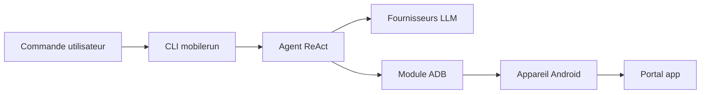

# droidrun/droidrun

> Mobilerun, ex DroidRun : framework pour piloter Android et iOS avec des agents LLM.

## Le problème
Automatiser des applications mobiles sans API oblige à des scripts fragiles ou à un test manuel.

## Ce que ça fait vraiment
Des commandes en langage naturel pilotent un appareil : lecture de l'arbre d'accessibilité et de captures d'écran, tap, glissement, saisie, lancement d'applications. Modes vision et raisonnement (gestionnaire-exécuteur), sorties structurées, outils personnalisés, traçage Arize Phoenix ou Langfuse. CLI, TUI, Docker et API Python. Modèles OpenAI, Anthropic, Gemini, xAI, Ollama, DeepSeek et OpenRouter.

## Comment c'est branché


## Essayer
```bash
uv tool install mobilerun
mobilerun setup
mobilerun configure
mobilerun run "Open settings and turn on dark mode"
```

## Coût et pièges
Python `>=3.11,<3.14`, ADB et un appareil avec débogage USB. Clé du fournisseur LLM à ta charge. Une offre Mobilerun Cloud payante existe en parallèle (téléphones hébergés).

## Ce que ce n'est pas
Le schéma d'architecture fourni décrit l'ancien projet DroidRun ; le README parle de Mobilerun. Les benchmarks sont cités sans détail ici. L'iOS passe par un flux Portal séparé.

## Alternatives
Aucune alternative nommée dans le README.

## Pour toi
À surveiller : intéressant pour du test d'applications mobiles par agent, mais dépend d'un LLM payant et d'un renommage récent.
