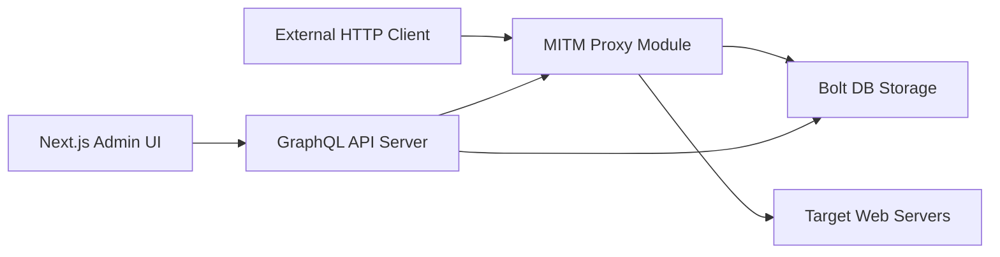

# dstotijn/hetty

> Boîte à outils HTTP open source pour la recherche en sécurité, proxy d'interception avec interface web.

## Le problème
Inspecter et rejouer du trafic HTTP pendant un audit autorisé demande un proxy d'interception. Les solutions commerciales du domaine sont payantes.

## Ce que ça fait vraiment
Un seul processus Go joue le rôle de proxy MITM, expose une API GraphQL et sert une interface web (Next.js). Il journalise les requêtes avec recherche, permet de les intercepter, de les modifier et de les rejouer, et gère un périmètre (scope). Les données sont stockées par projet dans une base Bolt embarquée.

## Comment c'est branché


## Essayer
```bash
brew install hettysoft/tap/hetty
sudo snap install hetty
hetty
hetty --help
docker run -v $HOME/.hetty:/root/.hetty -p 8080:8080 \
  ghcr.io/dstotijn/hetty:latest
```

## Coût et pièges
Gratuit, licence MIT. Le proxy génère une autorité de certification racine locale (`~/.hetty/`) dont la clé doit rester protégée. À n'utiliser que sur du trafic dont on a le droit de traiter le contenu.

## Ce que ce n'est pas
Ce n'est pas un équivalent complet des suites commerciales : le README dit viser cet objectif, pas l'avoir atteint. Il est présenté comme en développement actif ; la compilation depuis les sources est marquée « lien à venir ».

## Alternatives
- Burp Suite Pro : la référence commerciale citée, plus complète mais payante.

## Pour toi
À surveiller : pratique pour observer les appels HTTP d'un service ou d'une API de modèle en local, mais hors du cœur de métier data/IA et porté par un seul mainteneur.

