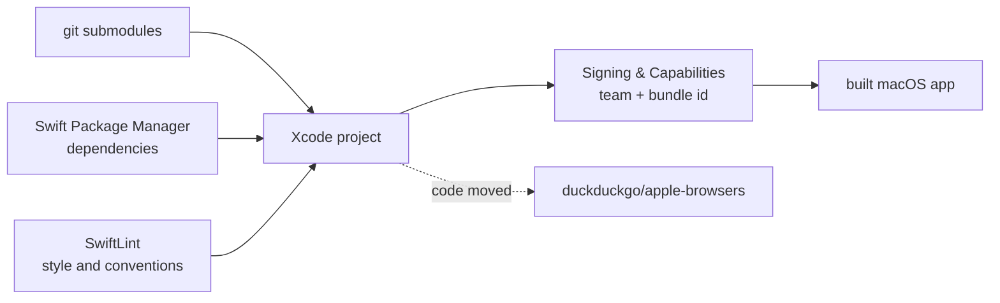

# duckduckgo/macos-browser

> **The source of the DuckDuckGo browser for macOS, at the address where it is no longer maintained.**

## The problem

The problem the software itself addresses — a desktop browser whose vendor claims to keep
search and browsing history anonymous — is not described in this README, which points to the
DuckDuckGo Help Center instead. The problem the *repository* poses is stated in its second
line: this is no longer where the code lives.

## What it actually does

This repository holds the Swift sources of the DuckDuckGo macOS application, and the README
documents only how to build it: pull the git submodules, let Swift Package Manager resolve
dependencies, install SwiftLint for style and conventions, and — if you are not on the
DuckDuckGo team — pick your own signing team and a custom bundle identifier under *Signing &
Capabilities*.

What the browser actually does — rendering engine, tracker blocking, sync, features — is **not
documented** here. There is no screenshot, no feature list, no architecture description. A
"Terminology" section records a vocabulary change in the repository (`main`, `allow lists`,
`blocklists`) and warns that closed issues and PRs may still carry the old wording.

Above all, the README states that the code has been **moved to `duckduckgo/apple-browsers`**
and that this repository no longer accepts contributions: bug reports and feature requests
belong in the new one.

## How it is wired



No code-derived diagram exists for this repository, and the README names no module and no
source file. This graph therefore shows only the build chain it describes, and assumes nothing
about the browser's internal architecture, which stays undocumented here.

## Try it

```bash
git submodule update --init --recursive
```

That is the **only** command in the README. There is no build command, no run command and no
test command: the README says to open the project and set *Signing & Capabilities* in Xcode,
which is done by hand. Installing SwiftLint is deferred to the `realm/SwiftLint` documentation,
with no command repeated here. Nothing has been reconstructed.

## Cost and traps

The code is **Apache-2.0**, free, with no API key and no account to create. The real cost lies
elsewhere and it is decisive: **the repository is archived on GitHub**, hence read-only — no
commits, no pull requests, no issues — and the README confirms it by refusing contributions.
The last push dates from 17 July 2025, more than a year without activity. Every fix, security
ones included, now goes to `duckduckgo/apple-browsers`.

The remaining cost is that of an Xcode project: a Mac, Xcode, an Apple developer account to
sign it yourself if you are not on the DuckDuckGo team, and SwiftLint installed separately.
None of those constraints exists in the `prerequis` vocabulary, hence the value `aucun` — read
it as "no key, no GPU, no Docker", not as "nothing to prepare". Neither a minimum macOS
version nor a minimum Xcode version is given.

## What it is not

- **It is not a live repository.** It is archived and read-only: you can read and clone it, but
  you can no longer open an issue, submit a patch, or expect an answer. The current address is
  `duckduckgo/apple-browsers`.
- **It is not a library or a framework**, contrary to the nature the catalogue assumed: this is
  the code of a complete desktop application, not a dependency to import into a project.
- **It is not the browser you install**: there are only sources to compile yourself here, and
  the README gives no download link for the public binary.

## Alternatives

No comparable alternative in the catalogue: it contains no other desktop browser, and the only
repository with the same purpose named by this README is **`duckduckgo/apple-browsers`**, the
designated successor — always prefer it, since it receives the code, the issues and the
contributions. `realm/SwiftLint` is cited too, but it is a Swift linter, not an alternative to
the browser.

## For you

Ignore it for a data / AI / MLOps profile: nothing to reuse, nothing to import, and the address
is dead. The only residual interest would be reading corporate application-level Swift, and
even then `duckduckgo/apple-browsers` is the place to open. The useful lesson here is about
catalogue reliability rather than technique: a repository with 271 stars can be archived and
wrongly filed as a "library", and only reading the README reveals it.
