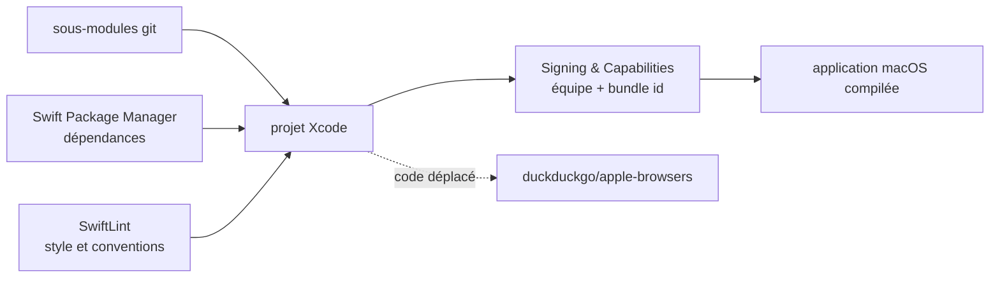

# duckduckgo/macos-browser

> **Le code source du navigateur DuckDuckGo pour macOS, à l'emplacement où il n'est plus maintenu.**

## Le problème

Le problème que résout le logiciel — un navigateur de bureau dont l'éditeur revendique
l'anonymat de l'historique de recherche et de navigation — n'est pas décrit dans ce README :
il renvoie au Help Center de DuckDuckGo. Le problème que pose le dépôt, lui, est explicite
dès la deuxième ligne : ce n'est plus ici que le code vit.

## Ce que ça fait vraiment

Ce dépôt héberge les sources Swift de l'application macOS de DuckDuckGo, et le README ne
documente que la façon de la compiler : récupérer les sous-modules, laisser Swift Package
Manager résoudre les dépendances, installer SwiftLint pour les conventions de style, et — si
l'on n'est pas de l'équipe DuckDuckGo — choisir sa propre équipe de signature et un
identifiant de bundle personnalisé dans *Signing & Capabilities*.

Ce que fait le navigateur lui-même — moteur de rendu, blocage de traqueurs, synchronisation,
fonctionnalités — n'est **pas documenté** dans ce README. Il n'y a ni copie d'écran, ni liste
de fonctions, ni description d'architecture. Une section « Terminology » signale un
renommage du vocabulaire du dépôt (`main`, `allow lists`, `blocklists`) et prévient que les
issues et PR closes peuvent contenir l'ancienne terminologie.

Et surtout : le README annonce que le code a été **déplacé vers `duckduckgo/apple-browsers`**
et que ce dépôt n'accepte plus de contributions, les rapports de bug et demandes de
fonctionnalité devant être déposés dans le nouveau.

## Comment c'est branché



Aucun diagramme tiré du code n'existe pour ce dépôt, et le README ne nomme aucun module ni
fichier source. Ce schéma ne reprend donc que la chaîne de compilation qu'il décrit, sans
rien supposer de l'architecture interne du navigateur, qui reste non documentée ici.

## Essayer

```bash
git submodule update --init --recursive
```

C'est la **seule** commande du README. Il n'y a ni commande de compilation, ni commande de
lancement, ni commande de test : le README dit d'ouvrir le projet et de régler *Signing &
Capabilities* dans Xcode, ce qui se fait à la souris. L'installation de SwiftLint est renvoyée
à la documentation de `realm/SwiftLint`, sans commande reprise ici. Rien n'est reconstruit.

## Coût et pièges

Le code est sous **Apache-2.0**, gratuit, sans clé d'API ni compte à créer. Le vrai coût est
ailleurs, et il est rédhibitoire : **le dépôt est archivé sur GitHub**, donc en lecture seule
— plus de commit, plus de PR, plus d'issue, et le README le confirme en refusant les
contributions. Le dernier push date du 17 juillet 2025, soit plus d'un an sans activité.
Tout correctif, y compris de sécurité, part désormais dans `duckduckgo/apple-browsers`.

Le reste du coût est celui d'un projet Xcode : un Mac, Xcode, un compte développeur Apple
pour signer soi-même si l'on n'est pas de l'équipe DuckDuckGo, et SwiftLint installé à part.
Aucune de ces contraintes n'existe dans le vocabulaire de `prerequis`, d'où la valeur
`aucun` — à lire comme « ni clé, ni GPU, ni Docker », pas comme « rien à préparer ». Ni la
version minimale de macOS, ni celle de Xcode, ne sont indiquées.

## Ce que ce n'est pas

- **Ce n'est pas un dépôt vivant.** Il est archivé et en lecture seule : on peut le lire et le
  cloner, on ne peut plus y ouvrir une issue, y proposer un patch, ni attendre une réponse.
  L'adresse à jour est `duckduckgo/apple-browsers`.
- **Ce n'est pas une bibliothèque ni un framework**, contrairement à ce que suggère la nature
  présumée du catalogue : c'est le code d'une application de bureau complète, pas une
  dépendance à importer dans un projet.
- **Ce n'est pas le navigateur qu'on installe** : ici il n'y a que des sources à compiler
  soi-même, et le README ne fournit aucun lien de téléchargement du binaire public.

## Alternatives

Aucune alternative comparable dans le catalogue : il ne contient aucun autre navigateur de
bureau, et le seul dépôt de même objet nommé par ce README est **`duckduckgo/apple-browsers`**,
le successeur désigné — à préférer systématiquement, puisqu'il reçoit le code, les issues et
les contributions. `realm/SwiftLint` est aussi cité, mais c'est un linter Swift, pas une
alternative au navigateur.

## Pour toi

À ignorer pour un profil data / IA / MLOps : rien à réutiliser, rien à importer, et l'adresse
est morte. Le seul intérêt résiduel serait d'aller lire du Swift applicatif d'entreprise, et
même dans ce cas il faut ouvrir `duckduckgo/apple-browsers`. La leçon utile de cette fiche est
de fiabilité du catalogue, pas de technique : un dépôt à 271 étoiles peut être archivé et
classé « bibliothèque » à tort, et seule la lecture du README le révèle.
