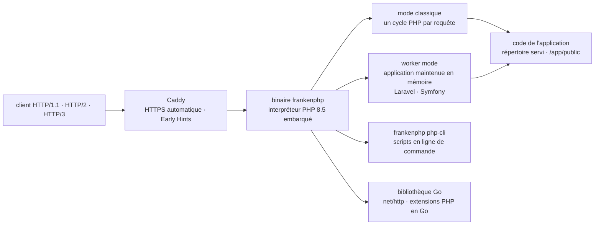

# dunglas/frankenphp

> **A PHP application server shipped as a single binary, in place of Nginx plus PHP-FPM.**

## The problem

Serving PHP usually means configuring and supervising two separate processes — a web server and
an FPM pool — wired together over FastCGI, plus a TLS certificate to obtain and renew. Each
request also starts from a blank interpreter: the framework (Laravel, Symfony) bootstraps in
full on every call, and recent HTTP capabilities — HTTP/2, HTTP/3, status code 103 — depend on
whatever front-end server sits in front.

## What it actually does

FrankenPHP is a PHP application server built **on top of the Caddy web server**. It replaces
the server-plus-FPM assembly with one executable that embeds the interpreter: the published
Linux binaries are statically linked and run on any distribution with no dependency to install,
the macOS ones are self-contained, and the Windows archives ship the official PHP binary. The
current build embeds PHP 8.5 with most popular extensions; the rpm, deb and apk packages offer
PHP 8.2 through 8.5.

The README lists as its own features: worker mode (the application stays in memory between
requests, with official Laravel and Symfony integrations), Early Hints, real-time support via
Mercure, hot reloading, automatic HTTPS, HTTP/2 and HTTP/3. Two modes coexist — classic (one
PHP cycle per request) and worker.

Beyond the server, the repository is also a **Go library**: PHP can be embedded in any
`net/http` application, PHP extensions can be written in Go, and standalone self-executable PHP
apps or static binaries can be produced. The reference documentation lives on `frankenphp.dev`
and `pkg.go.dev`; the README itself is mostly a table of contents.

## How it is wired



No code-derived diagram exists for this repository: this one is reconstructed from the README
alone, so it names only the parts the README mentions, not source files. The README points to
`docs/internals.md` for the real architecture. The structural point is that Caddy and the PHP
interpreter live in the **same process** — which is what makes worker mode and single-file
distribution possible.

## Trying it

Automatic install on Linux and macOS, then serving the current directory:

```console
curl https://frankenphp.dev/install.sh | sh
```

```console
frankenphp php-server
```

On Windows, in PowerShell:

```powershell
irm https://frankenphp.dev/install.ps1 | iex
```

Via Homebrew, or via Docker with nothing installed:

```console
brew install dunglas/frankenphp/frankenphp
```

```console
docker run -v .:/app/public \
    -p 80:80 -p 443:443 -p 443:443/udp \
    dunglas/frankenphp
```

Then open `https://localhost` (the README warns **not** to use `https://127.0.0.1`, and to
accept the self-signed certificate). A command-line script:

```console
frankenphp php-cli /path/to/your/script.php
```

## Cost and pitfalls

- **No license declared in the catalogue**: the batch row carries no license, no language and no
  star count, and the README shows no license badge. To be checked against the repository's
  `LICENSE` file before any internal use — that is the reason for the alert.
- **Installation goes through `curl … | sh` or `irm … | iex`**, i.e. running a remote script
  directly. The system packages are the more controllable path.
- **The rpm, deb and apk packages do not come from the project** but from "our maintainers", via
  the third-party domains `rpm.henderkes.com` and `pkg.henderkes.com`, with a repository key to
  install. An infrastructure dependency outside the repository.
- **Not every PHP extension is bundled**: missing ones go through PIE (`php/pie`), installed
  separately (`pie-zts`), and the embedded PHP is in ZTS mode — an incompatible extension will
  not load.
- **Worker mode is not free in discipline**: the application stays in memory across requests,
  which most PHP code written for the one-request-one-process model does not assume. The README
  points to a dedicated "Known issues" page.
- No monetary cost, no API key, no account to create: the project is an executable to download.

## What it is not

- **Not a hosting offer or a managed service.** It is a binary you run yourself; the README
  points to a separate "Deploy in production" page, a sign that the path to production is not
  covered by running it locally.
- **Not a drop-in replacement for PHP-FPM**: the README devotes a whole page to migrating from
  Nginx/PHP-FPM, and another to known issues. The announced gain comes from worker mode, which
  assumes a compatible application.
- **Not a speed-up of PHP itself**: the interpreter is still official PHP. What changes is what
  surrounds it — bootstrap, protocols, distribution.
- **Not a project for anyone who does not write PHP.** The Go library is there to *embed* PHP,
  not to avoid it.

## Alternatives

The catalogue offers **no neighbours** for this repository (the batch row is empty), so no
comparable alternative comes out of it: the lexical matching found nothing, which fits a Go/PHP
repository sitting alone in a catalogue oriented towards data and AI. The only comparison points
are the ones named in the README:

| | When to prefer it |
|---|---|
| **Nginx / PHP-FPM** | Named in the README as the subject of the migration page. Keep it when the infrastructure, modules and operational habits already exist, and the one-request-one-process model is fine. |
| **Caddy** (server alone) | The base FrankenPHP is built on. Enough if you serve static files, or want the reverse proxy and automatic HTTPS without embedding PHP. |

## For you

Outside the data / AI / MLOps scope: this is a PHP application server, and nothing in the README
touches training, inference or data. Worth watching for two transferable reasons only: the
distribution model — a self-sufficient static binary that embeds its own interpreter, applicable
to other languages — and worker mode, which is exactly the idea of loading a model once and for
all inside an inference server. Adopt it only if you already run PHP.
