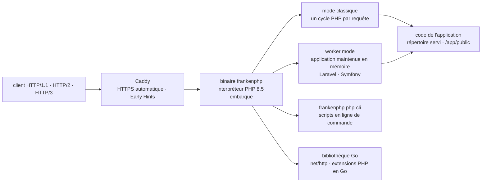

# dunglas/frankenphp

> **Un serveur d'applications PHP en un seul binaire, à la place du couple Nginx + PHP-FPM.**

## Le problème

Servir du PHP demande d'ordinaire deux processus à configurer et à surveiller séparément : un
serveur web et un pool FPM, reliés par FastCGI, plus un certificat TLS à obtenir et à
renouveler. Chaque requête repart en outre d'un interpréteur vierge : le cadre applicatif
(Laravel, Symfony) se réamorce intégralement à chaque appel, et les capacités HTTP récentes —
HTTP/2, HTTP/3, code de statut 103 — dépendent du serveur frontal.

## Ce que ça fait vraiment

FrankenPHP est un serveur d'applications PHP construit **sur le serveur web Caddy**. Il
remplace l'assemblage serveur + FPM par un exécutable unique qui embarque l'interpréteur : les
binaires Linux publiés sont liés statiquement et fonctionnent sur n'importe quelle
distribution sans dépendance, ceux de macOS sont autonomes, ceux de Windows contiennent le PHP
officiel. La version courante embarque PHP 8.5 et la plupart des extensions répandues ; les
paquets rpm, deb et apk proposent PHP 8.2 à 8.5.

Le README annonce comme fonctions propres : le *worker mode* (l'application reste chargée en
mémoire entre les requêtes, avec des intégrations officielles côté Laravel et Symfony), les
*Early Hints*, le temps réel via Mercure, le rechargement à chaud, HTTPS automatique, HTTP/2 et
HTTP/3. Deux modes coexistent, « classique » (une requête, un cycle PHP) et *worker*.

Au-delà du serveur, le dépôt est aussi une **bibliothèque Go** : on peut embarquer PHP dans
n'importe quelle application `net/http`, écrire des extensions PHP en Go, et produire des
applications PHP auto-exécutables ou des binaires statiques. La documentation de référence vit
sur `frankenphp.dev` et sur `pkg.go.dev` ; le README lui-même est surtout une table des
matières.

## Comment c'est branché



Aucun diagramme tiré du code n'existe pour ce dépôt : ce schéma est reconstruit depuis le seul
README, et n'en nomme donc que les pièces citées, pas les fichiers. Le README renvoie vers
`docs/internals.md` pour l'architecture réelle. Le point structurant est que Caddy et
l'interpréteur PHP sont dans le **même processus** : c'est ce qui rend possible le mode
*worker* et la distribution en un fichier.

## Essayer

Installation automatique sur Linux et macOS, puis service du répertoire courant :

```console
curl https://frankenphp.dev/install.sh | sh
```

```console
frankenphp php-server
```

Sur Windows, en PowerShell :

```powershell
irm https://frankenphp.dev/install.ps1 | iex
```

Par Homebrew, ou par Docker sans rien installer :

```console
brew install dunglas/frankenphp/frankenphp
```

```console
docker run -v .:/app/public \
    -p 80:80 -p 443:443 -p 443:443/udp \
    dunglas/frankenphp
```

Puis ouvrir `https://localhost` (le README avertit de **ne pas** utiliser `https://127.0.0.1`,
et d'accepter le certificat auto-signé). Un script en ligne de commande :

```console
frankenphp php-cli /path/to/your/script.php
```

## Coût et pièges

- **Licence non déclarée dans le catalogue** : la ligne du lot ne porte ni licence, ni langage,
  ni compte d'étoiles, et le README n'affiche aucun badge de licence. À lever sur le fichier
  `LICENSE` du dépôt avant tout usage interne — c'est la raison de l'alerte.
- **L'installation passe par `curl … | sh` ou `irm … | iex`**, c'est-à-dire l'exécution directe
  d'un script distant. Les paquets système sont une voie plus contrôlable.
- **Les paquets rpm, deb et apk ne viennent pas du projet** mais de « nos mainteneurs », via les
  domaines tiers `rpm.henderkes.com` et `pkg.henderkes.com`, avec une clé de dépôt à installer.
  Une dépendance d'infrastructure externe au dépôt.
- **Les extensions PHP ne sont pas toutes là** : celles absentes passent par PIE
  (`php/pie`), à installer séparément (`pie-zts`), et le PHP embarqué est en mode ZTS —
  une extension non compatible ne se chargera pas.
- **Le mode *worker* n'est pas gratuit en discipline** : l'application reste en mémoire entre
  les requêtes, ce que la plupart des codes PHP écrits pour le modèle « une requête, un
  processus » ne supposent pas. Le README renvoie à une page « Known issues » dédiée.
- Pas de coût monétaire, pas de clé d'API, pas de compte à créer : le projet est un exécutable
  à télécharger.

## Ce que ce n'est pas

- **Ce n'est pas un hébergement ni un service géré.** C'est un binaire à faire tourner soi-même ;
  le README renvoie à une documentation « Deploy in production » séparée, signe que le chemin
  vers la production n'est pas couvert par l'exécution locale.
- **Ce n'est pas un remplaçant de PHP-FPM par simple substitution** : le README consacre une
  page entière à la migration depuis Nginx/PHP-FPM, et une autre aux problèmes connus. Le gain
  annoncé vient du mode *worker*, qui suppose une application compatible.
- **Ce n'est pas une accélération de PHP lui-même** : l'interpréteur reste le PHP officiel. Ce
  qui change est ce qui l'entoure — amorçage, protocoles, distribution.
- **Ce n'est pas un projet pour qui n'écrit pas de PHP.** La bibliothèque Go sert à *embarquer*
  PHP, pas à s'en passer.

## Alternatives

Le catalogue ne propose **aucun voisin** pour ce dépôt (la ligne du lot est vide), donc aucune
alternative comparable n'en sort : le rapprochement par lexique n'a rien trouvé, ce qui est
cohérent avec un dépôt Go/PHP isolé dans un catalogue orienté données et IA. Les seuls points
de comparaison sont ceux nommés dans le README :

| | Quand le préférer |
|---|---|
| **Nginx / PHP-FPM** | Nommé dans le README au titre de la page de migration. À garder quand l'infrastructure, les modules et les habitudes d'exploitation existent déjà, et que le modèle « une requête, un processus » convient. |
| **Caddy** (serveur seul) | La base sur laquelle FrankenPHP est construit. Suffit si l'on sert du statique ou si l'on veut le proxy et le HTTPS automatique sans embarquer PHP. |

## Pour toi

Hors périmètre data / IA / MLOps : c'est un serveur d'applications PHP, et rien dans le README
ne concerne l'entraînement, l'inférence ou les données. À surveiller pour deux raisons
transférables seulement : le modèle de distribution — un binaire statique auto-suffisant qui
embarque son interpréteur, applicable à d'autres langages — et le mode *worker*, exactement la
même idée que le chargement d'un modèle une fois pour toutes dans un serveur d'inférence. À
adopter uniquement si l'on exploite déjà du PHP.
