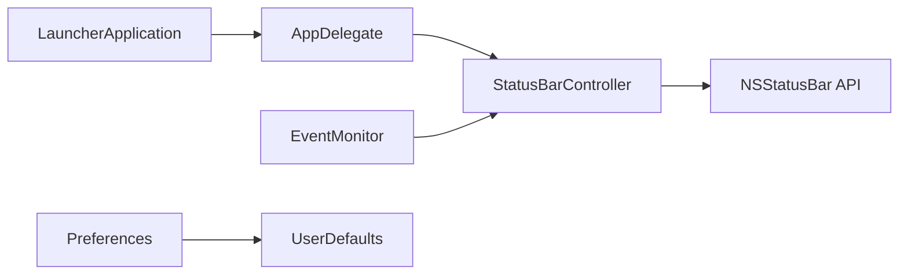

# dwarvesf/hidden

> Application macOS qui masque des icônes de la barre de menus pour la garder propre.

## Le problème
La barre de menus d'un Mac se remplit d'icônes de petites applications qui la saturent.

## Ce que ça fait vraiment
Une icône flèche dans la barre de menus : on la clique pour cacher ou montrer les icônes placées à sa gauche ; on réorganise avec ⌘ + glisser. Le projet Swift/AppKit comprend deux cibles : l'app principale (`StatusBarController`, `EventMonitor`, préférences dans `UserDefaults`) et un lanceur pour le démarrage automatique via `SMAppService`. Aucun réseau ni serveur.

## Comment c'est branché


## Essayer
```bash
brew install --cask hiddenbar
```
Sinon : télécharger la dernière version, la glisser dans Applications, puis ⌘ + glisser l'icône pour la placer entre d'autres.

## Coût et pièges
Gratuit. Exige macOS 13 (Ventura) ou plus ; la dernière version pour macOS 10.13 à 12 est la v1.10. Le README affirme que l'app est notarisée hors App Store.

## Ce que ce n'est pas
Ce n'est pas un gestionnaire de fenêtres ni un outil de productivité complet ; seulement le masquage d'icônes.

## Alternatives
Le README cite d'autres utilitaires de la même équipe (Blurred, Micro Sniff, VimMotion), qui font autre chose.

## Pour toi
Ignorer : confort pour Mac sans lien avec un travail data/IA/MLOps ; à installer si la barre de menus te gêne, sans enjeu professionnel.

