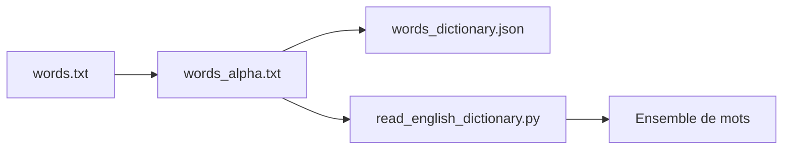

# dwyl/english-words

> Fichiers texte de plus de 466 000 mots anglais, pour auto-complétion ou import en base.

## Le problème
Il faut une liste de mots anglais brute, sans passer par un fichier Excel.

## Ce que ça fait vraiment
Fournit `words.txt` (tous les mots), `words_alpha.txt` (lettres seules) et `words_dictionary.json` (mots vers 1). Un exemple Python, `read_english_dictionary.py`, charge la liste dans un ensemble.

## Comment c'est branché


## Essayer
```bash
python read_english_dictionary.py
```
Le README ne donne pas d'autre commande : on télécharge les fichiers.

## Coût et pièges
Gratuit. La liste vient d'un fichier infochimps dont le README dit : « Copyright still belongs to them » ; la licence Unlicense du dépôt ne règle pas cette origine. Dernier push janvier 2025.

## Ce que ce n'est pas
Pas un dictionnaire de définitions, ni un lexique nettoyé : contient des mots rares ou douteux. Aucune garantie de qualité dans le README.

## Alternatives
Aucune alternative nommée dans le README.

## Pour toi
À surveiller : pratique pour des tests ou du prototypage NLP, mais à ne pas embarquer dans un produit sans vérifier l'origine des droits.

