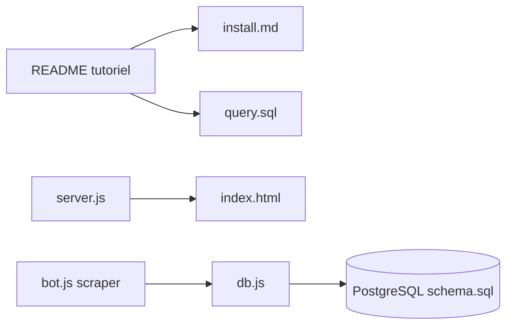

# dwyl/learn-postgresql

> Tutoriel d'initiation à PostgreSQL et SQL pour développeurs débutants, installation et requêtes de base.

## Le problème
Les débutants ne savent pas par où commencer pour stocker et interroger des données de façon fiable.

## Ce que ça fait vraiment
Un README long explique pourquoi apprendre SQL, installe Postgres (Postgres.app sur macOS, apt sur Ubuntu), crée base et utilisateurs, ajoute PostGIS avec un exemple `ST_Distance`, et résume commandes psql, jointures, groupements, clés étrangères. Le dépôt contient aussi un petit exemple Node avec un scraper GitHub et un schéma SQL ; les fichiers de guides n'ont pas été échantillonnés.

## Comment c'est branché


## Essayer
```bash
sudo apt-get update
sudo apt-get install postgresql postgresql-contrib
sudo -u postgres createuser --interactive
psql
```

## Coût et pièges
Gratuit. Contenu partiellement daté (liens, captures) et orienté macOS/Ubuntu. Aucune licence déclarée : réutilisation incertaine.

## Ce que ce n'est pas
Pas une référence avancée : pas d'optimisation, de modélisation ni de MLOps. Pas un outil exécutable.

## Alternatives
Aucune alternative citée dans le README (liens vers des cours externes).

## Pour toi
À surveiller seulement comme révision de base ; si tu connais déjà SQL, la doc officielle de PostgreSQL est plus utile.

