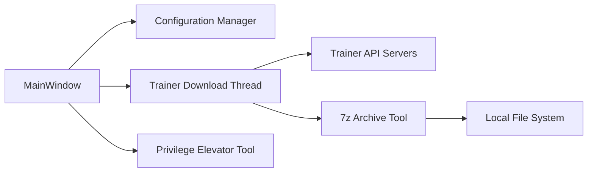

# dyang886/Game-Cheats-Manager

> Application Windows qui rassemble et télécharge des trainers de jeux solo depuis plusieurs sources.

## Le problème
Trouver, télécharger, ranger et mettre à jour des trainers de jeux (outils de triche) demande de fouiller des sites douteux.

## Ce que ça fait vraiment
Une interface de bureau Python : recherche bilingue anglais/chinois, téléchargement au double-clic (décompression avec 7-Zip, rangement par dossier et version), mise à jour automatique à chaque lancement, import local, sources activables (Fling, XiaoXing, Cheat Tables, trainers du projet, trainers communautaires relus manuellement). Un assistant ajoute les dossiers aux exclusions de Windows Defender.

## Comment c'est branché

## Essayer
Aucune commande : le README décrit un installeur Windows 64 bits à télécharger sur la page des releases, à exécuter, puis à lancer.

## Coût et pièges
Gratuit, Windows seulement. Les trainers modifient la mémoire des jeux et déclenchent des alertes antivirus ; l'app propose de les mettre en liste blanche dans Defender, ce qui affaiblit la protection de la machine. Des binaires tiers sont exécutés ; GPL-3.0.

## Ce que ce n'est pas
Ce n'est pas un outil de développement ni d'analyse : il gère des exécutables de triche pour jeux solo. Le README dit aussi fournir des instructions de contournement d'anti-cheat.

## Alternatives
Le README cite ses propres sources (Fling, XiaoXing, Cheat Tables) ; pas d'alternative directe nommée.

## Pour toi
Ignorer : outil de jeu sans rapport avec data/IA/MLOps, qui te demande de désactiver la surveillance antivirus de la machine.

