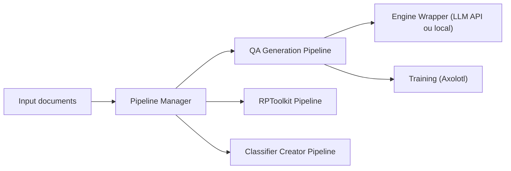

# e-p-armstrong/augmentoolkit

> Pipelines pour transformer des documents en jeux de données et entraîner un LLM expert d'un domaine.

## Le problème
Faire apprendre un domaine nouveau à un LLM exige de fabriquer des données d'entraînement variées et de piloter le fine-tuning.

## Ce que ça fait vraiment
Trois familles de pipelines : QA factuel (chunking, questions, validation, réponses), RPToolkit (jeux de rôle multi-tours) et créateur de classifieurs. S'y ajoutent GRPO expérimental, correction, rephrase, RAG. Interface web ou CLI, génération via API ou modèle local, entraînement via Axolotl (finetune complet annoncé vers 20 $). Reprend automatiquement les runs interrompus.

## Comment c'est branché


## Essayer
```bash
git clone https://github.com/e-p-armstrong/augmentoolkit.git
cd augmentoolkit # Python == 3.11
bash linux.sh
bash local_linux.sh normal
```

## Coût et pièges
Python 3.11 ; Valkey requis (compilé s'il manque) ; génération rapide seulement avec GPU ou API payante ; entraînement sur machine puissante ou location. Petits jeux de données : peu de pas d'optimisation, apprentissage faible.

## Ce que ce n'est pas
Pas une garantie d'expertise : le README lui-même signale que les petits jeux de données apprennent mal. Les superlatifs (« best way in the world ») sont de l'auteur et non mesurés.

## Alternatives
Aucune alternative nommée dans le README.

## Pour toi
À surveiller : pertinent si tu prépares des données de fine-tuning de domaine, mais le mainteneur est unique et le coût GPU réel est à mesurer.
