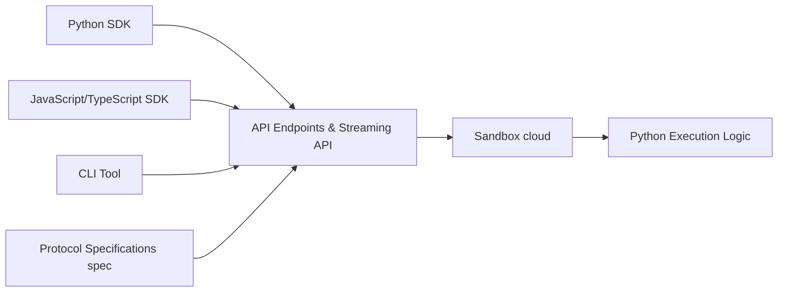

# e2b-dev/E2B

> Sandboxes cloud isolées pour exécuter du code généré par IA, pilotées par SDK JS ou Python.

## Le problème
Exécuter le code d'un agent LLM sur ta machine ou ton serveur est dangereux ; il faut une isolation jetable.

## Ce que ça fait vraiment
`Sandbox.create()` lance un environnement isolé ; `commands.run()` exécute des commandes.
SDK Code Interpreter : `runCode()` renvoie les résultats d'exécution.
SDK Desktop : souris, clavier, captures, lancement d'applis pour le « computer use ».
Infrastructure auto-hébergeable via Terraform sur AWS ou GCP.

## Comment c'est branché


## Essayer
```bash
pip install e2b
pip install e2b-code-interpreter
npm i e2b
```

## Coût et pièges
Compte et `E2B_API_KEY` requis ; auto-hébergement possible mais lourd (Terraform, AWS/GCP, Azure pas encore).

## Ce que ce n'est pas
Pas un agent : juste l'environnement d'exécution. Sans auto-hébergement, ton code passe par leur cloud.

## Alternatives
Aucune alternative nommée dans le README.

## Pour toi
À adopter pour tout agent qui exécute du code (analyse de données, code interpreter) : isolation propre en quelques lignes, licence Apache.
