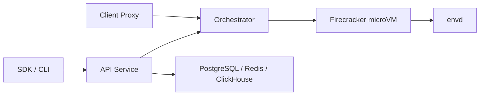

# e2b-dev/infra

> Runtime open source d'E2B : micro-VM Firecracker qui exécutent du code d'agents dans des bacs isolés.

## Le problème
Un agent qui exécute du code non fiable a besoin d'un environnement isolé, rapide à démarrer et suspendable.

## Ce que ça fait vraiment
Une sandbox est un snapshot restauré : mémoire servie à la demande (userfaultfd), disque en copy-on-write. Pause et reprise avec diff en stockage objet, fork d'un bac en cours, templates construits depuis des images Docker, pare-feu de sortie par bac. Le plan de contrôle (API Go) est séparé de l'orchestrateur par nœud ; `envd` tourne dans chaque VM. Télémétrie OpenTelemetry vers ClickHouse.

## Comment c'est branché


## Essayer
```bash
mkdir e2b && cd e2b
curl -fsSL --remote-name-all "https://raw.githubusercontent.com/e2b-dev/runtime/main/embed/compose/{compose.yaml,.env}"
docker compose up -d --wait
```

## Coût et pièges
Linux avec KVM obligatoire. Le paquet Embed est présenté comme un package d'évaluation, pas comme un déploiement de production. La version cloud demande une clé d'API sur e2b.dev.

## Ce que ce n'est pas
Pas un simple SDK : c'est toute l'infrastructure, lourde à exploiter soi-même. Le README parle du dépôt e2b-dev/runtime, le catalogue de e2b-dev/infra.

## Alternatives
- Aucune alternative nommée dans le README.

## Pour toi
À surveiller : pertinent si tu veux héberger toi-même l'exécution de code d'agents ; sinon le service cloud E2B est plus simple.
