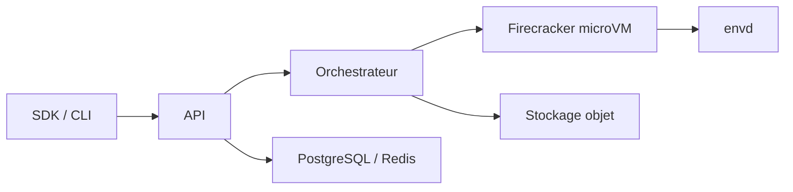

# e2b-dev/runtime

> Backend open source d'E2B : microVMs Firecracker restaurées depuis snapshot pour exécuter du code d'agents.

## Le problème
Faire tourner du code non fiable généré par un agent exige une isolation forte et un démarrage rapide, difficiles à bâtir soi-même.

## Ce que ça fait vraiment
Une sandbox est un snapshot restauré (mémoire servie à la demande via userfaultfd, disque en copy-on-write). L'API de contrôle place les sandboxes ; l'orchestrateur par nœud pilote Firecracker, réseau et cgroups. Pause/reprise, fork de sandbox, templates construits depuis des images Docker, `envd` dans chaque VM (processus, fichiers, ports), URLs par port, volumes, secrets, télémétrie OpenTelemetry vers ClickHouse.

## Comment c'est branché


## Essayer
```bash
mkdir e2b && cd e2b
curl -fsSL --remote-name-all "https://raw.githubusercontent.com/e2b-dev/runtime/main/embed/compose/{compose.yaml,.env}"
docker compose up -d --wait
```
```python
from e2b import Sandbox
with Sandbox.create() as sandbox:
    result = sandbox.commands.run('echo "Hello from E2B!"')
```

## Coût et pièges
Linux avec KVM requis ; la version Embed est « un paquet d'évaluation, pas un modèle de production ». Le cloud E2B demande une clé d'API. 206 issues ouvertes.

## Ce que ce n'est pas
Pas un simple SDK : c'est toute l'infrastructure (API, orchestrateur, proxy, build). Le déploiement production en propre passe par l'offre entreprise.

## Alternatives
Aucune alternative nommée dans le README.

## Pour toi
À surveiller : utile si tu dois héberger toi-même des sandboxes d'agents ; sinon le cloud E2B suffit et évite l'exploitation de Firecracker.

