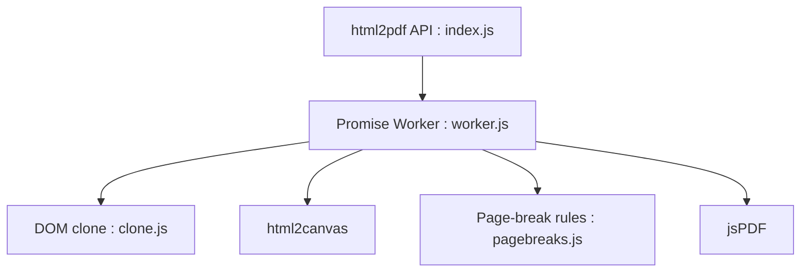

# eKoopmans/html2pdf.js

> Bibliothèque JavaScript qui convertit une page ou un élément HTML en PDF directement dans le navigateur.

## Le problème
Générer un PDF à partir de HTML sans serveur de rendu.

## Ce que ça fait vraiment
Clone l'élément, le rend en canvas via html2canvas, découpe l'image en pages et produit le PDF avec jsPDF. Gère les sauts de page CSS et les liens. Fonctionne côté navigateur uniquement, pas sous Node.js.

## Comment c'est branché


## Essayer
```bash
npm install --save html2pdf.js
```
```js
html2pdf(document.getElementById('element-to-print'));
```

## Coût et pièges
Gratuit. Le texte est rendu en image : non sélectionnable, fichiers lourds. Limite de taille de canvas : les grands documents peuvent sortir blancs. 501 issues ouvertes.

## Ce que ce n'est pas
Pas un moteur PDF vectoriel ni un outil serveur. Le README liste ses défauts connus (clonage de nœuds, redimensionnement).

## Alternatives
- jsPDF : la brique de sortie utilisée directement, plus bas niveau.
- html2canvas : le moteur de rendu dont dépend la qualité.

## Pour toi
À surveiller : pratique pour exporter un rapport ou dashboard depuis une page, mais inadapté à de la génération PDF fiable ou textuelle.

